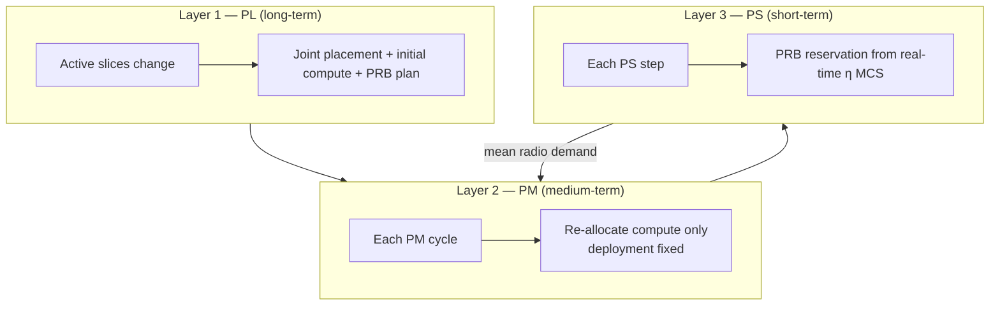

# INA-Infra Simulation (`simulation.py`)

Demo simulation of the three-layer INA-Infra resource-allocation algorithm over staged slice activation. Compared with `solver.py` (paper-style, 4 slices × 1000 PM cycles), this script uses **8 slices**, a shorter horizon (**10 PM × 10 PS = 100 steps**), and interactive plots.

## Requirements

- Python 3 with `gurobipy`, `numpy`, `matplotlib`
- Gurobi **academic / unrestricted** license (size-limited free tier fails once ≥5 slices activate Layer-1 PL)

```bash
cd algorithm/INA-Infra
python3 simulation.py
```

Headless (save figures instead of GUI):

```bash
MPLBACKEND=Agg python3 -c "
import matplotlib; matplotlib.use('Agg')
import matplotlib.pyplot as plt
i=[0]
def show(*a,**k):
    i[0]+=1; plt.savefig(f'sim_output/simulation_fig{i[0]}.png', dpi=150, bbox_inches='tight'); plt.close('all')
plt.show=show
import runpy; runpy.run_path('simulation.py', run_name='__main__')
"
```

## Architecture

Locations `j ∈ {0,1,2}` map to **Edge / Regional / Central** DCs. Each slice places **CU-UP** (`x`), **UPF** (`y`), and **APP** (`z`) at exactly one location.



| Layer | Function | Timescale | Decisions |
|---|---|---|---|
| **PL** | `run_layer_1_pl(active_slices)` | On slice activation | CU/UPF/APP placement, initial CPU/RAM/GPU, baseline `b_min` |
| **PM** | `run_layer_2_pm(active_slices, deploy_map, t_demand)` | End of each PM cycle | Compute re-allocation (placement fixed) |
| **PS** | `run_layer_3_ps(eta_realtime, active_slices)` | Every PS step | Dedicated / priority PRBs from channel efficiency η |

**Dynamic path** = PL + PM + PS. **Static baseline** = PL only (frozen compute and `b_min` after each PL solve).

## Simulation loop

```
for pm_cycle in 0 .. NUM_PM_CYCLES-1:          # 10
    if schedule activates new slices:
        PL → update deploy_map, current_resources, baseline_resources
    for each active slice:
        compute_cap = min(α·CPU_CU, α·CPU_UPF, γ·APP_CPU/RAM/GPU)
    for ps_step in 0 .. PS_STEPS_PER_PM-1:     # 10
        sample MCS → η
        PS → b_min; share unused PRB slack equally
        actual_T = min(radio_potential, compute_cap)
        violation = max(0, T̄ − actual_T)
        (same metrics for static baseline)
    PM → re-tune compute from mean radio demand
```

### Slice activation schedule

| PM cycle | New slices | Active set |
|---|---|---|
| 0 | S1–S3 | {1,2,3} |
| 3 | S4–S6 | {1…6} |
| 6 | S7–S8 | {1…8} |

Defined by `ACTIVATION_SCHEDULE = {0: [1,2,3], 3: [4,5,6], 6: [7,8]}`.

## Slice requirements (`SLICES_INFO`)

Built at import time from the loop over `S_SLICES` (`random.seed(2025)`). Stored fields:

| Field | Code key | Meaning |
|---|---|---|
| Throughput SLA | `T_bar` (`T̄`) | Minimum throughput (Mbps); soft target in PL/PM/PS |
| Delay SLA | `D_bar` (`D̄`) | Maximum end-to-end delay (ms); enforced in **PL only** |
| Hard isolation | `H_s` | If `1`, dedicated PRBs: `b_ded ≥ b_min` (URLLC) |
| Initial η | `eta_t0` | PRB efficiency at PL time from MCS ∈ [10, 20] |
| Type | `Type` | Label for logging / plots |

### Per-slice requirements

| Slice | Type | `T̄` (Mbps) | `D̄` (ms) | `H_s` | Activates at step | Notes |
|---|---|---:|---:|---:|---:|---|
| S1 | mMTC | 40 | 100 | 0 | 0 | Relaxed delay; shared PRBs |
| S2 | mMTC | 40 | 100 | 0 | 0 | Same class as S1 |
| S3 | mMTC(Reg) | 40 | 30 | 0 | 0 | Tighter delay → prefers regional-ish placement |
| S4 | URLLC(Split) | 60 | 20 | 1 | 30 | Hard isolation; moderate URLLC delay |
| S5 | URLLC(Edge) | 60 | 10 | 1 | 30 | Strictest delay; hard isolation |
| S6 | eMBB(Edge) | 100 | 15 | 0 | 30 | High throughput; edge-oriented delay |
| S7 | eMBB | 100 | 35 | 0 | 60 | High throughput; looser delay |
| S8 | eMBB | 100 | 35 | 0 | 60 | Same class as S7 |

### How requirements are used

- **`T̄`** — PL/PM/PS add slack penalties if planned/allocated throughput is below `T̄`. At each PS step, reported violation is `max(0, T̄ − actual_T)`.
- **`D̄`** — PL builds `D = D_F1[CU] + D_N3[CU,UPF] + D_N6[UPF,APP]` and penalizes `ξ_D ≥ D − D̄`. PM/PS do not re-check delay.
- **`H_s`** — PL and PS enforce `b_ded ≥ b_min · H_s` (URLLC gets fully dedicated PRBs).
- **`eta_t0`** — Used only in PL for the initial PRB/throughput coupling; runtime PS uses freshly sampled MCS → η.

## Key parameters

| Symbol / name | Role | Default |
|---|---|---|
| `C_N_CAPACITY` / `R_N_CAPACITY` | NF CPU / RAM per DC | Edge 400/5k … Central 5k/100k |
| `C_A_*` / `R_A_*` / `G_A_*` | APP CPU / RAM / GPU | per DC |
| `ALPHA_CU`, `ALPHA_UPF` | Compute → throughput for CU / UPF | 1.02 / 0.81 |
| `GAMMA_C/R/G` | APP resource → throughput | 0.5 / 0.008 / 1.0 |
| `D_F1`, `D_N3`, `D_N6` | Link delays by location pair | ms |
| `B_TOTAL` | Total PRBs | 273 |
| `W_C`, `W_P` | Cost vs penalty weights | 1.0 / 1000.0 |
| `BETA_DEMAND` | PM demand-slack weight | 0.1 |
| `calculate_eta(mcs)` | Mbps per PRB from MCS table (4 MIMO layers) | — |

## MILP objectives (summary)

1. **PL** — minimize infra cost + PRB cost + penalties for delay / PRB / compute SLA shortfall; subject to single-site placement, capacity, delay linearization (`xy`, `yz`), and throughput coupling.
2. **PM** — minimize compute cost + SLA/demand penalties with **fixed** placement.
3. **PS** — minimize PRB cost + SLA shortfall given real-time η; `b_ded ≤ b_min`, hard isolation when `H_s=1`.

## Layer I/O examples

Locations: `0=Edge`, `1=Regional`, `2=Central`. Examples below use active slices `{1,2,3}` (first PL batch). Numeric values are from a real Gurobi solve and may vary slightly with solver version.

### Layer 1 — PL

```python
deploy_map, init_resources = run_layer_1_pl(active_slices)
```

| | Type | Meaning |
|---|---|---|
| **Input** | `active_slices: list[int]` | e.g. `[1, 2, 3]` |
| (globals) | `SLICES_INFO`, capacities, costs, delays | SLAs `T̄`/`D̄`/`H_s`/`η₀` read from `SLICES_INFO[s]` |
| **Output** | `deploy_map: dict[int, tuple[int,int,int]]` | `{s: (loc_CU, loc_UPF, loc_APP)}` |
| **Output** | `init_resources: dict[int, dict]` | Per-slice compute + baseline `b_min` |

Example input:

```python
active_slices = [1, 2, 3]
# SLICES_INFO[1] ≈ {Type: mMTC, T_bar: 40, D_bar: 100, H_s: 0, eta_t0: ~3.16}
```

Example output:

```python
deploy_map = {
    1: (2, 2, 2),   # CU/UPF/APP all Central
    2: (2, 2, 2),
    3: (1, 2, 2),   # CU Regional; UPF+APP Central
}
init_resources = {
    1: {
        'a_c_cu': 39.22, 'a_r_cu': 10.0,
        'a_c_upf': 49.38, 'a_r_upf': 10.0,
        'a_c_app': 80.0, 'a_r_app': 5000.0, 'a_g_app': 40.0,
        'b_min': 13.0,
    },
    # S2/S3: similar compute; b_min ≈ 24 / 11
}
```

If not optimal: both return `{}`.

Pseudocode (Gurobi style):

```text
function run_layer_1_pl(active_slices):
    m = Model("PL")

    // Variables
    x, y, z          = binary placement of CU / UPF / APP on DCs
    a_c_*, a_r_*, a_g_*  = compute amounts
    b_ded, b_min     = PRBs
    T_plan, D_plan   = planned throughput / delay
    ξ_D, ξ_PRB, ξ_Com = SLA shortfalls (≥ 0)

    // Objective
    m.setObjective(
        W_C · (compute_cost + prb_cost) + W_P · (ξ_D + ξ_PRB + ξ_Com),
        MINIMIZE
    )

    // Constraints
    m.addConstr( each NF on exactly one DC )
    m.addConstr( T_plan ≤ f(compute) )              // throughput from resources
    m.addConstr( D_plan = F1 + N3 + N6 )            // delay from placement
    m.addConstr( ξ_D ≥ D_plan − D̄ )
    m.addConstr( ξ_PRB ≥ T̄ − η₀ · b_min )
    m.addConstr( ξ_Com ≥ T̄ − T_plan )
    m.addConstr( b_ded ≤ b_min ; URLLC ⇒ b_ded = b_min )
    m.addConstr( DC capacity not exceeded )
    m.addConstr( sum b_min ≤ B_TOTAL )

    m.optimize()
    return placement from x,y,z  and  resources from a_*, b_min
```

### Layer 2 — PM

```python
new_resources = run_layer_2_pm(active_slices, deployment_map, t_demand)
```

| | Type | Meaning |
|---|---|---|
| **Input** | `active_slices` | Same active set, e.g. `[1, 2, 3]` |
| **Input** | `deployment_map` | Fixed placement from PL (`deploy_map`) |
| **Input** | `t_demand: dict[int, float]` | Target throughput per slice (Mbps); sim uses mean radio potential from the last PM’s PS steps |
| **Output** | `new_resources: dict[int, dict]` | Updated compute only (no `b_min`, no new placement) |

Example input:

```python
active_slices = [1, 2, 3]
deployment_map = {1: (2, 2, 2), 2: (2, 2, 2), 3: (1, 2, 2)}
t_demand = {1: 45.0, 2: 42.0, 3: 50.0}   # illustrative; sim uses np.mean(radio_demands_buffer[s])
```

Example output:

```python
new_resources = {
    1: {
        'a_c_cu': 44.12, 'a_r_cu': 10.0,
        'a_c_upf': 55.56, 'a_r_upf': 10.0,
        'a_c_app': 90.0, 'a_r_app': 5625.0, 'a_g_app': 45.0,
    },
    2: {'a_c_cu': 41.18, ...},  # scaled toward demand
    3: {'a_c_cu': 49.02, ...},
}
```

Pseudocode (Gurobi style):

```text
function run_layer_2_pm(active_slices, deployment_map, t_demand):
    m = Model("PM")
    // placement fixed from PL — no x,y,z

    // Variables
    a_c_*, a_r_*, a_g_*  = compute amounts
    T_curr               = throughput
    ξ_SLA, ξ_Dem         = shortfalls (≥ 0)

    // Objective
    m.setObjective(
        W_C · compute_cost + W_P · (ξ_SLA + β · ξ_Dem),
        MINIMIZE
    )

    // Constraints
    m.addConstr( T_curr ≤ f(compute) )
    m.addConstr( ξ_SLA ≥ T̄ − T_curr )
    m.addConstr( ξ_Dem ≥ t_demand − T_curr )
    m.addConstr( DC capacity not exceeded )   // using fixed placement

    m.optimize()
    return updated a_* per slice
```

### Layer 3 — PS

```python
b_min_map = run_layer_3_ps(eta_realtime, active_slices)
```

| | Type | Meaning |
|---|---|---|
| **Input** | `eta_realtime: dict[int, float]` | Mbps/PRB per active slice from current MCS |
| **Input** | `active_slices` | e.g. `[1, 2, 3]` |
| **Output** | `b_min_map: dict[int, float]` | Guaranteed PRB count `b_min` per slice |

Example input:

```python
active_slices = [1, 2, 3]
eta_realtime = {1: 2.78, 2: 2.78, 3: 2.78}   # e.g. MCS 15 → calculate_eta(15)
```

Example output:

```python
b_min_map = {1: 15.0, 2: 15.0, 3: 15.0}
```

Pseudocode (Gurobi style):

```text
function run_layer_3_ps(eta_realtime, active_slices):
    m = Model("PS")

    // Variables
    b_ded, b_min  = PRBs
    ξ_prb         = shortfall (≥ 0)

    // Objective
    m.setObjective(
        W_C · prb_cost + W_P · ξ_prb,
        MINIMIZE
    )

    // Constraints
    m.addConstr( sum b_min ≤ B_TOTAL )
    m.addConstr( b_ded ≤ b_min )
    m.addConstr( URLLC ⇒ b_ded = b_min )
    m.addConstr( ξ_prb ≥ T̄ − η · b_min )

    m.optimize()
    return b_min per slice
```

After PS (Python, not Gurobi):

```text
extra     = leftover_PRBs / num_slices
radio     = (b_min + extra) · η
actual_T  = min(radio, compute_cap)
```

## Outputs (plots via `plt.show()`)

1. Real-time throughput + SLA violation (dynamic)
2. Optimal deployment topology (CU / UPF / APP per slice across Edge–Regional–Central)
3. Per-slice bottleneck (SLA vs compute cap vs radio guaranteed vs actual)
4. Resource utilization % (APP CPU/RAM/GPU and NF CPU/RAM per DC)
5. Dynamic vs static comparison (first 60 steps, slices 1–6)

Console: `Starting Simulation...` then `PM Cycle k finished.` for `k = 0..9`.

## Relation to `solver.py`

| | `simulation.py` | `solver.py` |
|---|---|---|
| Slices | 1–8, staged activation | 1–4, all at t=0 |
| Horizon | 10 × 10 = 100 steps | 1000 × 10 = 10 000 steps |
| Baselines | Dynamic vs static (PL-only) | Multi / Static / Single |
| Artifacts | Interactive figures | Also writes `avg_*.pdf`, `cdf_violation.pdf` |

Use `simulation.py` for a quick end-to-end demo; use `solver.py` for longer statistical comparison.
