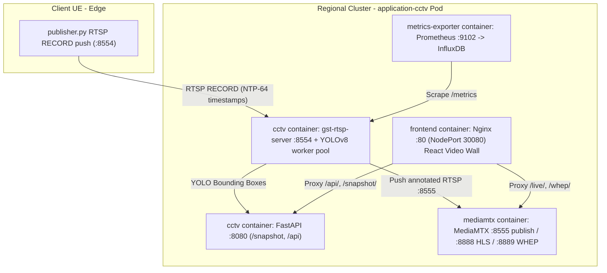

# Slice A — CCTV Vision Streaming

Lab runbook (IPs, GitOps, API, MediaMTX): **[docs/cctv.md](../../docs/cctv.md)**.

Containerized client to edge pipeline that streams video over the 5G OTA
interface via RTSP, runs YOLO inference at the edge, and measures per-frame
end-to-end (e2e) delay against a ~20 ms UL latency SLO.

Per-frame capture wall-clock travels **in-band via RTP/RTCP** (no pixel
overlay): the publisher's RTCP Sender Reports map RTP time to NTP wall clock and
each RTP packet also carries the RFC 6051 NTP-64 header extension. The analyzer
reconstructs capture time from `GstReferenceTimestampMeta` and computes
`delay = now - capture`.

## Architecture (Pattern B — Multi-Container Pod)

The CCTV server runs on the Regional cluster as a unified multi-container Pod:



The multi-container pod contains 3 dedicated application containers + 1 metrics exporter sidecar:
1. **`cctv`** (Backend) — GStreamer RECORD Ingest on Multus (`10.1.137.161:8554` with static MAC `02:42:0a:01:89:a1`), YOLOv8 inference workers (BGR native pipeline), FastAPI (`/snapshot`, `/api`), and Prometheus exporter (`:9102`).
2. **`mediamtx`** (Media Server) — Standalone MediaMTX v1.12.2 process on `127.0.0.1`, ingesting annotated RTSP streams and remuxing live HLS fMP4 segments (`/live/`) & WebRTC WHEP (`/whep/`) for multi-subscriber fanout with 0% extra CPU on the inference backend.
3. **`frontend`** (Web Gateway) — Nginx serving the React Video Wall SPA on NodePort `30080`, reverse-proxying API, snapshots, and HLS streaming with on-demand `IntersectionObserver` video mounting.
4. **`metrics-exporter`** (Sidecar) — InfluxDB pusher scraping Prometheus `:9102`.

## Repository Layout

```
applications/cctv/
  client/     publisher.py (UE RTSP RECORD push), Dockerfile, entrypoint.sh
  edge/       cctv.py (GStreamer RTSP Ingest + Server), api.py (FastAPI), state.py, yolo_worker.py, mtx_publish.py, mediamtx.yml, Dockerfile, entrypoint.sh
  frontend/   React Video Wall SPA (Vite, TypeScript, Nginx), Dockerfile, nginx.conf
  common/     metrics.py (Prometheus telemetry helpers)
  data/       Sample video assets (classroom.mp4, traffic.mp4, example.mp4)
  dashboard/  Grafana dashboard definition & push script (dashboard_push.sh)
```

**UE-push model.** The edge runs a `gst-rtsp-server` in **RECORD** mode and the
UE pushes to it with `rtspclientsink` over a single **outbound** connection
(TCP-interleaved by default). This is required on a real 5G bearer: the UE has a
private UE-pool IP behind the UPF/N6 NAT and is **not reachable inbound**, so the
edge cannot connect back to it. Only the signaling/connection direction changed
versus a pull model -- the media (and its wall-clock carriage) still flows uplink
UE -> edge, so the absolute-timestamp path is preserved.

There is still **no relay**: the `cctv.py` RTSP server terminates the stream
directly, so absolute timestamps stay entirely within GStreamer. This avoids
MediaMTX, whose `useAbsoluteTimestamp` propagation proved unreliable during M1
(sustained ~1.27 s timestamp excursions + `received RTP packet without absolute
time` warnings; upstream mediamtx #5355).

- OTA (5G data plane): CCTV RTSP RECORD server on `EDGE_OTA_IP`; the UE
  publisher pushes to it. RTCP SR + the RFC 6051 NTP-64 header extension travel
  outbound from the UE (the direction we want).
- Metrics/NTP plane (`ens0`): Prometheus scrape of `/metrics` and chrony sync.

## Layout

```
applications/cctv/
  client/     publisher.py (rtspclientsink RECORD push), entrypoint.sh, Dockerfile
  edge/       cctv.py (gst-rtsp-server RECORD -> YOLO), api.py, yolo_worker.py, entrypoint.sh, Dockerfile
  common/     metrics.py (slice-agnostic helpers, shared buckets)
  data/       drop VIDEO_SOURCE files here (example.mp4 included)
```

## Verified results (single-host, OTA simulated with a bridge)

Measured with the bundled `data/example.mp4` (1920x1012 @ 60 fps, transcoded to
1280x720 @ 25 fps, 4 Mbps H.264).

### Push-mode re-verification (M1, YOLO off, no GPU)

The RTSP RECORD push path was re-verified on a CPU-only host. The
reference-timestamp meta survives the flip (`frames_without_ts_total` settles at
~2 warmup frames, then stops), `net_delay` is recorded on every frame, and the
segment-seek loop plays the clip continuously with no stall:

| Transport | stream fps | `net_delay` p50 / p99 | `frames_without_ts_total` |
|---|---|---|---|
| **udp** | 25 | ~10.8 / ~13 ms | 2 (warmup) |
| **tcp** (default) | 25 | ~11 / ~50 ms | 2 (warmup) |

- **UDP meets the 20 ms UL SLO** (p99 ~13 ms). Prefer it when the UPF permits an
  RTCP UDP pinhole back to the UE.
- **TCP-interleaved is the most NAT/firewall-robust** (single outbound
  connection) but carries a ~40 ms delayed-ACK/Nagle tail on top of the ~10 ms
  host-bound encode+decode baseline, pushing p99 over the SLO. Choose transport
  per your NAT constraints vs latency budget (`RTSP_PROTOCOL`).
- The ~10 ms p50 baseline is the CPU `x264enc` + decode cost on this test host
  (`net_delay` = capture -> appsink); expect it lower on faster/edge-class CPUs.

### Earlier pull-mode baseline (A40 host, for reference)

These were measured under the previous edge-pulls design on the A40 GPU host and
are kept for the GPU/inference figures:

| Metric | YOLO off (M1) | YOLO on, CPU (M2) | YOLO on, GPU (M2, A40) |
|---|---|---|---|
| stream fps (decoded) | 25 | 25 | 25 |
| analyzed fps | 25 | ~14 (YOLO-bound) | 25 (every frame) |
| `net_delay` p50 / p99 | ~2.3 / ~3.0 ms | ~2.5 / ~3.0 ms | ~2.5 / ~3.0 ms |
| `yolo_delay` p50 / p99 | — | ~73 ms | ~5.1 / ~5.3 ms |
| `e2e_delay` p50 / p99 | ~2.5 ms | ~135 ms | ~8.2 / ~8.9 ms |
| `frames_without_ts_total` | 1 (first frame) | 1 | 1 |
| backlog growth | none | none (leaky queue) | none |

`net_delay` is measured at decoder output (before the leaky queue) so it stays
independent of inference backpressure.

On the NVIDIA A40 the full **capture -> encode -> RTSP -> decode -> YOLO**
`e2e_delay` p99 (~8.9 ms) stays under the 20 ms SLO while inferring on **every**
frame (`FRAME_SKIP=1`). GPU is the default here (see below); use `YOLO_DEVICE=cpu`
+ `TORCH_INDEX_URL=.../cpu` for CPU-only hosts.

### GPU inference

The analyzer runs YOLO on the GPU by default in the local/edge compose files.
Requirements: an NVIDIA GPU + driver and the `nvidia-container-toolkit` (the
`nvidia` Docker runtime). The image is built with a CUDA torch wheel
(`TORCH_INDEX_URL`, default `cu121`) and the analyzer service reserves the GPU
via `deploy.resources.reservations.devices`. Confirm the container sees it:

```bash
docker exec slicea-analyzer python3 -c "import torch; print(torch.cuda.get_device_name(0))"
nvidia-smi   # a python3 process appears while streaming
```

CPU-only fallback (no toolkit / no GPU):

```bash
YOLO_DEVICE=cpu TORCH_INDEX_URL=https://download.pytorch.org/whl/cpu \
  docker compose -f docker-compose.local.yml up --build -d
```

## Quick start (single host)

```bash
cp .env.example .env            # only needed for the two-host compose files
docker compose -f docker-compose.local.yml up --build -d
docker logs -f slicea-analyzer
```

The OTA interface is simulated with a Docker bridge, so this runs anywhere.
Toggles (env, no rebuild):

```bash
# M1 timestamp proof, no inference:
YOLO_ENABLED=false docker compose -f docker-compose.local.yml up -d
# UDP transport instead of TCP-interleaved (default is tcp):
RTSP_PROTOCOL=udp docker compose -f docker-compose.local.yml up -d
# Run YOLO every Nth frame:
FRAME_SKIP=3 docker compose -f docker-compose.local.yml up -d
```

Expected analyzer log line (JSON):

```json
{"event":"analyzer_stats","fps":25.0,"analyzed_fps":25.0,"net_delay_p50_ms":2.5,
 "net_delay_p99_ms":3.0,"yolo_delay_p50_ms":5.1,"e2e_delay_p50_ms":8.2,
 "e2e_delay_p99_ms":8.9,"detections":8,"yolo_enabled":true}
```

## Two-host / OTA deployment

Prerequisites:

1. Both hosts NTP-synced to the **same** server over `ens0` (never OTA). e2e
   accuracy is bounded by the clock offset; keep it < 5 ms and export it.
2. An OTA macvlan parent interface (e.g. `ens1`) reachable between the hosts.
3. Docker + Compose v2.

Steps:

- Edit `.env`: `PUBLISHER_OTA_IP` (client), `EDGE_OTA_IP` (analyzer),
  `OTA_PARENT_IFACE`, `OTA_SUBNET`, `OTA_GATEWAY`, `VIDEO_SOURCE`.
- **Edge host (start first):** `docker compose -f docker-compose.edge.yml up --build -d`
  (analyzer serves the RTSP RECORD endpoint `rtsp://EDGE_OTA_IP:8554/slicea`).
- **Client host:** `docker compose -f docker-compose.client.yml up --build -d`
  (publisher pushes to `rtsp://EDGE_OTA_IP:8554/slicea`; it retries with backoff
  until the edge server is reachable, so start order is not strict).

If the slicing setup already provisions the OTA network, set the `ota` network to
`external: true` in both compose files instead of the inline macvlan block.

## Configuration (env matrix)

| Variable | Side | Default | Description |
|---|---|---|---|
| `VIDEO_SOURCE` | client | `/data/example.mp4` | File (looped) or `/dev/videoN` |
| `PUBLISHER_OTA_IP` | client | `10.45.0.20` | UE's own OTA address (uplink source) |
| `EDGE_OTA_IP` | both | `10.45.0.10` | Analyzer OTA address (RTSP RECORD endpoint) |
| `RTSP_PORT` / `STREAM_PATH` | both | `8554` / `slicea` | RTSP endpoint |
| `RTSP_PROTOCOL` | client | `tcp` | `tcp` (single outbound conn) or `udp` |
| `FPS` / `WIDTH` / `HEIGHT` / `BITRATE_KBPS` | client | `25` / `1280` / `720` / `4000` | Encode params |
| `RTSP_TARGET_HOST` | client | `${EDGE_OTA_IP}` | Edge host the UE pushes to |
| `BIND_ADDRESS` | edge | `${EDGE_OTA_IP}` | Address the RTSP server binds |
| `YOLO_ENABLED` | edge | `true` | Toggle inference off the path |
| `YOLO_MODEL` | edge | `yolov8n.pt` | Ultralytics weights |
| `YOLO_DEVICE` | edge | `cuda:0` | `auto` / `cpu` / `cuda:0` |
| `TORCH_INDEX_URL` | edge (build) | `.../cu121` | torch wheel index; `.../cpu` for CPU-only |
| `FRAME_SKIP` | edge | `1` | Run YOLO every Nth analyzed frame |
| `RTSP_LATENCY_MS` | edge | `0` | rtspsrc jitter buffer |
| `CLIENT_METRICS_PORT` / `EDGE_METRICS_PORT` | — | `9101` / `9102` | `/metrics` ports |
| `CHRONYC_HOST` | both | (empty) | Host running chronyd to query |
| `CHRONY_MAX_OFFSET_MS` | both | `5` | Warn threshold on skew |
| `OTA_PARENT_IFACE` / `OTA_SUBNET` / `OTA_GATEWAY` | both | — | macvlan config |

## Metrics

Exposed on `/metrics` (ports above), scraped off `ens0`. Histogram buckets are
tightly packed around the 20 ms UL target (see `common/metrics.py`):

```
0.005, 0.010, 0.015, 0.0175, 0.020, 0.0225, 0.025, 0.030, 0.040, 0.060, 0.100, 0.250, 1.0
```

| Metric | Type | Where |
|---|---|---|
| `slicea_net_delay_seconds` | histogram | analyzer (at decoder output) |
| `slicea_yolo_delay_seconds` | histogram | analyzer |
| `slicea_e2e_delay_seconds` | histogram | analyzer |
| `slicea_frames_processed_total` | counter | analyzer (decoded frames) |
| `slicea_frames_dropped_total` | counter | analyzer (leaky-queue drops) |
| `slicea_frames_without_ts_total` | counter | analyzer |
| `slicea_client_frames_sent_total` | counter | publisher |
| `slicea_client_encode_seconds` | histogram | publisher |
| `slicea_fps` | gauge | both |
| `slicea_clock_offset_seconds` | gauge | both |

### Prometheus scrape

Add to the monitoring stack's [prometheus.yml](../prometheus-grafana/prometheus/prometheus.yml):

```yaml
- job_name: slicea
  static_configs:
    - targets: ["CLIENT_HOST:9101", "EDGE_HOST:9102"]
  metrics_path: /metrics
```

### SLO recording / alerting rule

```promql
# Network component of e2e p99 under the 20 ms UL target:
histogram_quantile(0.99, rate(slicea_net_delay_seconds_bucket[1m])) < 0.020

# Full e2e (network + inference):
histogram_quantile(0.99, rate(slicea_e2e_delay_seconds_bucket[1m]))
```

## Milestones

- **M1 — Timestamp path proof:** run with `YOLO_ENABLED=false`; confirm
  `net_delay` logged and `frames_without_ts_total` stays 0 after warmup.
  *Verified.* (This gate is what surfaced the MediaMTX flakiness and drove the
  pivot to a direct GStreamer RTSP server.)
- **M2 — YOLO:** enable YOLO; confirm `yolo_delay`/`e2e_delay` logged and no
  backlog growth (leaky queue drops old frames; `frames_dropped_total` rises).
  *Verified.*
- **M3 — Metrics + logs:** `curl :PORT/metrics` shows all series with the
  specced buckets. *Verified.*
- **M4 — Containerization:** `docker compose up` runs the full chain, env-only
  config. *Verified (single-host).*
- **M5 — Two-host/OTA:** OTA macvlan attach; edge serves the RTSP RECORD
  endpoint on `EDGE_OTA_IP`; UE pushes to it from behind the UPF NAT; both clock
  offsets exported; reconnect verified. *Pending real two-host hardware.*

**Final soak:** >= 10 min at target FPS; p99 net_delay stable, near-zero
`frames_without_ts`, memory flat; restart the analyzer and confirm auto-recovery.

## Design notes / troubleshooting

- **No pixel/QR overlay** (perf); timestamps are in-band.
- **Why push (RTSP RECORD)?** On a real 5G bearer the UE is behind the UPF/N6
  NAT with a private UE-pool IP and cannot accept an inbound connection, so a
  pull model (edge connecting to a server on the UE) fails. The UE therefore
  opens the connection outbound and pushes via RTSP RECORD; the media still
  flows uplink so the timestamp mechanism is unchanged.
- **Reference-timestamp meta on the RECORD server:** the analyzer enables
  `ntp-sync` and `add-reference-timestamp-meta` on the server's internal
  `rtpbin` (via a `deep-element-added` hook from `media-configure`), since that
  rtpbin is created during media preparation and is not named in the launch
  line. Without it the depayed frames carry no `GstReferenceTimestampMeta` and
  `frames_without_ts_total` climbs.
- **Do not use OpenCV `VideoCapture` for RTSP receive** — it discards RTCP
  timing. The GStreamer `appsink` path is mandatory.
- **MP4 sources are auto-remuxed to faststart** at startup: `decodebin` forces
  `qtdemux` into push mode, which fails when the `moov` atom is at EOF. The
  publisher remuxes (no re-encode) once into `/tmp` (H.264-in-MP4 assumed).
- **`net_delay` is measured at decoder output**, before a `leaky` queue, so it
  stays clean even when CPU YOLO cannot keep up with the source frame rate.
- **Why not MediaMTX?** M1 showed MediaMTX (>= 1.12, tested 1.15.2) periodically
  losing the absolute-time mapping (`useAbsoluteTimestamp`, upstream #5355),
  producing sustained ~1.27 s delay excursions. Terminating the stream directly
  on a GStreamer RTSP endpoint (no relay) eliminated them (excursions gone,
  `frames_without_ts` ≈ 1).
- **`net_delay` implausibly large/negative:** clock skew. Check
  `slicea_clock_offset_seconds`; both hosts must sync to the same NTP server.

## Notes for future slices

`common/metrics.py` is slice-agnostic (buckets, metrics server, chrony reader,
JSON logger). Slices B/C/D reuse it; keep Slice-A-specific metric names out of
it.
