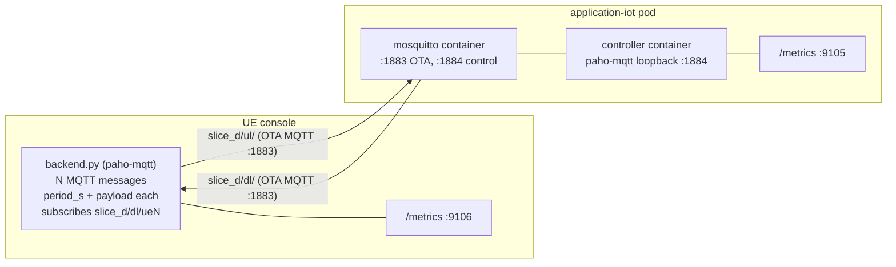

# Slice D — Background IoT / Best-Effort Load Generator

One of four 5G network slices (A: CCTV/YOLO, B: VLM, C: eMBB streaming, **D:
this one**). Slice D has **no SLO** — it is a deliberately best-effort MQTT
load generator. Its measurements exist to demonstrate that slices A–C stay
protected while Slice D soaks up whatever capacity is left.

Each container has two logical NICs:

- **`ens0`** (metrics plane): Prometheus `/metrics`, chrony/NTP. Never carries
  service traffic.
- **OTA** (5G data plane): all MQTT traffic. This is the path under measurement.

## Architecture



- **Uplink** `slice_d/ul/<device_id>`: UE → Mosquitto :1883 (OTA).
- **Downlink** `slice_d/dl/<device_id>`: controller → Mosquitto :1884 → UE :1883.
- Mosquitto runs in a **dedicated container**. The controller and dashboard talk
  to it on **loopback `:1884`** in the same pod so that hop never pollutes the
  OTA measurement; UEs connect over **OTA (`:1883`)**.

## Layout

```
iot/
├── client/     iot_client.py (compose/lab fleet), entrypoint.sh, Dockerfile
├── ue/         per-UE console (backend + frontend): N messages, period, payload
├── mosquitto/  dedicated Eclipse Mosquitto broker image
├── edge/       controller.py (no broker), entrypoint.sh, Dockerfile
├── common/     metrics.py (payload build/parse, shared buckets + metric factory)
├── docker-compose.yml
└── README.md
```

## Quick start (single host, OTA simulated with a bridge)

```bash
cd deploy/iot
docker compose up --build -d
docker logs -f sliced-edge      # UL delays per tier + summary line
docker logs -f sliced-client    # DL delays + summary line
curl -s localhost:9104/metrics | grep sliced_   # client series
curl -s localhost:9105/metrics | grep sliced_   # edge series
```

Fast smoke test (see counters/histograms fill within ~60 s):

```bash
FAST_PERIOD_S=2 MED_PERIOD_S=5 SLOW_PERIOD_S=10 DL_FAST_PERIOD_S=3 \
  docker compose up --build -d
```

Higher load:

```bash
NUM_DEVICES=50 docker compose up -d
```

Turn on per-message DEBUG logs:

```bash
LOG_LEVEL=DEBUG docker compose up -d
```

## How delays are measured

Each payload carries `t_send` (unix epoch seconds, float) stamped immediately
before publish. The receiver computes `delay = t_recv - t_send`. This is a valid
**one-way** delay **only because both containers are chrony-synced to the same
NTP source over `ens0`** — never over the OTA path being measured.

A **separate probe thread** on each UE also sends a tiny `slice_d/probe/<dev>`
message (timestamp only, ~100 B) every `LATENCY_PROBE_PERIOD_S` (default 0.5 s).
The controller echoes `slice_d/probe-ack/<dev>` immediately. The UE records
**RTT = t_ack - t_send** (clock-independent). When bulk MQTT fills the PDU,
that probe RTT rises — the same method OTT uses as an indirect YouTube-path
latency (HTTP echo competing with Chromium downlink).

Grafana `app_ue_latency_ms` is fed from the probe, not from large sensor payloads.

Negative delays (receiver clock behind sender) are clamped to `0` and counted in
`sliced_clock_skew_events_total`, so a skewed clock is visible rather than
silently producing bogus sub-zero readings.

Throughput ("TP used") is defined as **application-layer payload bytes/s over
OTA**, counted per direction as Prometheus counters and surfaced via `rate()`.

## Configuration (env, defaults set in `docker-compose.yml`)

| Variable | Default | Side | Meaning |
|---|---|---|---|
| `BROKER_HOST` / `BROKER_PORT` | `10.46.0.10` / `1883` | client | Broker OTA address |
| `OTA_BIND_IP` | client `10.46.0.20`, edge `10.46.0.10` | both | Local OTA IP the MQTT socket binds to |
| `METRICS_BIND_IP` / `METRICS_PORT` | `0.0.0.0` / `9104` (client), `9105` (edge) | both | Prometheus endpoint on ens0 |
| `NUM_DEVICES` | `5` | client | Simulated devices |
| `FAST_PERIOD_S` / `MED_PERIOD_S` / `SLOW_PERIOD_S` | `60` / `1800` / `3600` | client | UL report periods |
| `DL_FAST_PERIOD_S` / `DL_SLOW_PERIOD_S` | `300` / `3600` | edge | DL control periods |
| `PAYLOAD_BYTES_FAST/MED/SLOW` | `256` / `1024` / `4096` | client | UL payload size (incl. padding) |
| `DL_PAYLOAD_BYTES` | `256` | edge | DL payload size |
| `DEVICE_TTL_S` | `7200` | edge | Drop a device from DL fan-out after this idle time (2× slow period) |
| `MQTT_QOS` | `0` | both | `0` (best-effort) or `1` |
| `LATENCY_PROBE_PERIOD_S` | `0.5` | client | Dedicated timestamped probe interval |
| `JITTER_FRAC` | `0.1` | client | ±fraction randomisation of periods (avoids lockstep) |
| `LOG_LEVEL` | `INFO` | both | `DEBUG` adds per-message lines |
| `CHRONYC_HOST` / `CHRONY_MAX_OFFSET_MS` | (empty) / `5` | both | chrony query host + skew warn threshold |
| `OTA_SUBNET` | `10.46.0.0/24` | compose | OTA bridge subnet (single-host) |

`OTA_BIND_IP` binds the MQTT socket to the OTA interface (client: paho
`bind_address`; broker: `listener 1883 <ip>`). `METRICS_BIND_IP` binds the
Prometheus HTTP server; **set it to the `ens0` IP in production** so scraping
stays off the OTA path (default `0.0.0.0` is only for single-host convenience).

## Metrics

Delay histogram buckets (best-effort, seconds), shared in `common/metrics.py`:

```
0.005, 0.010, 0.025, 0.050, 0.100, 0.250, 0.500, 1.0, 2.5, 5.0, 10.0
```

| Metric | Type | Labels | Where |
|---|---|---|---|
| `sliced_ul_delay_seconds` | histogram | `tier` | edge (uplink one-way delay) |
| `sliced_dl_delay_seconds` | histogram | `tier` | client (downlink one-way delay) |
| `sliced_ul_bytes_sent_total` / `sliced_ul_messages_sent_total` | counter | `tier` | client |
| `sliced_ul_bytes_received_total` / `sliced_ul_messages_received_total` | counter | `tier` | edge |
| `sliced_dl_bytes_sent_total` / `sliced_dl_messages_sent_total` | counter | `tier` | edge |
| `sliced_dl_bytes_received_total` / `sliced_dl_messages_received_total` | counter | `tier` | client |
| `sliced_mqtt_connected` | gauge | — | both |
| `sliced_mqtt_reconnects_total` | counter | — | both |
| `sliced_publish_errors_total` | counter | — | both |
| `sliced_clock_skew_events_total` | counter | — | both |
| `sliced_clock_offset_seconds` | gauge | — | both |
| `sliced_devices_active` | gauge | — | edge |

Summary line (both sides, every `LOG_INTERVAL_S`):

```
[slice-d client] up=64s conn=1 tp_ul=1.2kB/s tp_dl=0.1kB/s avg_dl_delay=42ms (n=12) reconnects=0
[slice-d edge]   up=64s conn=1 tp_ul=1.2kB/s tp_dl=0.1kB/s avg_ul_delay=39ms (n=45) reconnects=0 devices=5
```

### Prometheus scrape config

Add to the monitoring stack's
[`prometheus.yml`](../prometheus-grafana/prometheus/prometheus.yml):

```yaml
- job_name: slice_d
  metrics_path: /metrics
  static_configs:
    - targets: ["CLIENT_HOST:9104", "EDGE_HOST:9105"]
```

(On the single-host bridge setup both are reachable on the compose host as
`localhost:9104` / `localhost:9105`.)

### Example PromQL

```promql
# Uplink throughput used over OTA (bytes/s, all tiers):
sum(rate(sliced_ul_bytes_received_total[5m]))

# Per-tier downlink throughput:
sum by (tier) (rate(sliced_dl_bytes_received_total[5m]))

# p95 downlink delay:
histogram_quantile(0.95, sum by (le, tier) (rate(sliced_dl_delay_seconds_bucket[5m])))

# p95 uplink delay:
histogram_quantile(0.95, sum by (le, tier) (rate(sliced_ul_delay_seconds_bucket[5m])))
```

Recording rules for TP/delay are fine for dashboards; **no SLO alert rules** ship
for Slice D (it is explicitly non-SLO).

## Two-host / real OTA deployment

1. NTP-sync both hosts to the **same** server over `ens0` (never OTA); keep the
   offset small and watch `sliced_clock_offset_seconds`.
2. Replace the `ota_net` bridge with the project's macvlan/external OTA network
   (edit `docker-compose.yml` — a commented `external: true` block is shown).
3. Set `EDGE_OTA_IP`, `CLIENT_OTA_IP`, `BROKER_HOST` (= edge OTA IP) and
   `METRICS_BIND_IP` (= each host's `ens0` IP).

## Acceptance checks

1. `docker compose up` → both containers healthy; client logs show connection.
2. Fast smoke (`FAST_PERIOD_S=2 …`): within 60 s edge logs UL delays per tier,
   client logs DL delays, and `/metrics` on both ports show non-zero counters +
   histogram samples for every tier.
3. Kill the edge container → client logs reconnect attempts;
   `sliced_mqtt_reconnects_total` increments after it comes back; no crash.
4. `NUM_DEVICES=50` → CPU/mem sane; all 50 devices in `sliced_devices_active`;
   DL fan-out reaches all.
5. Skew a clock → `sliced_clock_skew_events_total` rises; no negative delays.

## Non-goals

- No SLO / alert rules (recording rules for dashboards are fine).
- No TLS/auth on MQTT — isolated testbed only (`allow_anonymous true`).
- No persistence / QoS 2 / retained messages.
