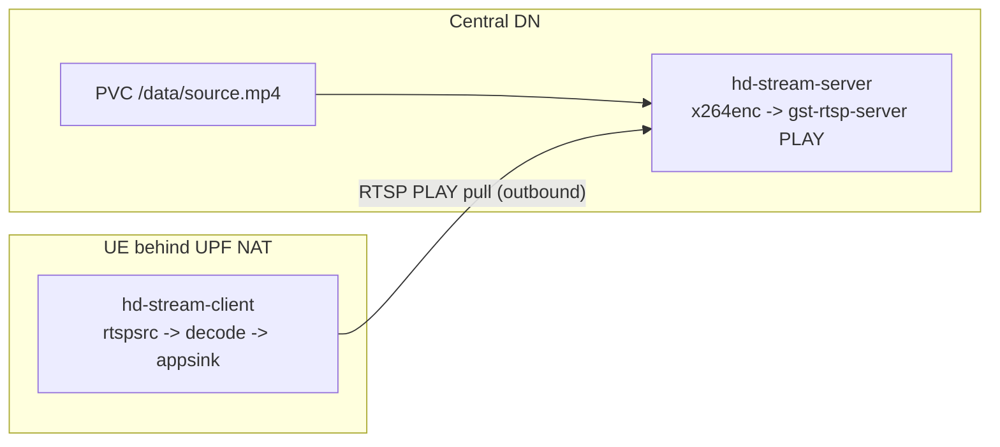

# hd-stream — central HD source → UE client

Containerized downlink pipeline: the **central** host serves a looped MP4 over
RTSP PLAY; the **UE client** pulls and decodes it, measuring per-frame network
delay. No YOLO.

Per-frame send wall-clock travels **in-band via RTP/RTCP** (RTCP SR + RFC 6051
NTP-64). The client reconstructs it from `GstReferenceTimestampMeta` and
computes `net_delay = now - send_time`.

## Architecture



**Why PLAY pull?** The UE has a private pool IP behind UPF/N6 NAT and cannot
accept inbound connections. The client opens one outbound RTSP session to the
central `externalIP`.

## Layout

```
hd-stream/
  server/     PLAY RTSP server + encode metrics
  client/     PLAY pull receiver + net_delay metrics
  common/     metrics helpers (shared buckets / JSON logs)
  data/       drop source.mp4 here (or fetch via scripts/)
  docker-compose.local.yml
```

## Quick start (single host)

```bash
./scripts/fetch_source_video.sh   # Big Buck Bunny ~10 min (archive.org, ~62 MiB)
docker compose -f docker-compose.local.yml up --build -d
docker logs -f hd-stream-client
```

## Metrics

| Metric | Type | Where |
|---|---|---|
| `hdstream_net_delay_seconds` | histogram | client |
| `hdstream_frames_processed_total` | counter | client |
| `hdstream_frames_without_ts_total` | counter | client |
| `hdstream_server_frames_sent_total` | counter | server |
| `hdstream_server_encode_seconds` | histogram | server |
| `hdstream_fps` | gauge | both |
| `hdstream_clock_offset_seconds` | gauge | both |

Defaults: client `/metrics` **9111**, server **9112**, RTSP **8556** `/hdstream`.

## Kubernetes / GitOps

Rendered by `nephio-network-slicing-ntt/scripts/render_oai_slice_deployment_gitops.sh`:

- central: PVC + `hd-stream-server` Deployment/Service (`externalIP` on mgmt LAN)
- edge: `hd-stream-client` sidecar in `oai-ue-3` (`PDU_IFACE=oaitun_ue1`)
