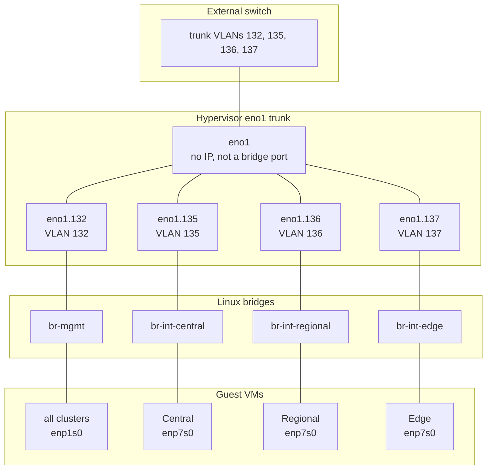

# Testbed bringup (bridges, VLAN uplinks, vm-sw)

Physical **802.1Q VLANs** on hypervisor **`eno1`** join each Nephio cluster to external L2. Site fabric (**vm-sw**, `br-ext-*`) simulates WAN latency between clusters on the host.

Related: [docs/testbed.md](../../docs/testbed.md) · [docs/topology.md](../../docs/topology.md) · [docs/mgmt.md](../../docs/mgmt.md) · [docs/ip_plan.md](../../docs/ip_plan.md)

## VLAN uplinks — join clusters to external L2

Hypervisor **`eno1`** is an **802.1Q trunk** (no IP, not a bridge port). VLAN subinterfaces are bridge ports:

| VLAN ID | Host interface | Bridge | Cluster(s) on that L2 | Guest NIC | Subnets |
|---------|----------------|--------|------------------------|-----------|---------|
| **132** | `eno1.132` | `br-mgmt` | **all** (mgmt + every cluster) | `enp1s0` | `10.1.132.0/24` |
| **135** | `eno1.135` | `br-int-central` | **central** | `enp7s0` | `10.1.137.0/24`, `10.1.138.0/24` |
| **136** | `eno1.136` | `br-int-regional` | **regional** | `enp7s0` | `.137` / `.138` |
| **137** | `eno1.137` | `br-int-edge` | **edge** | `enp7s0` | `.137` / `.138` |
| — | — | `br-int-ue` | **ue** (host-only) | `enp7s0` | `.137` / `.138` |



**External side:** configure the upstream switch/router port as a **trunk** with VLANs **132**, **135**, **136**, **137** (or a subset for partial peering). Each VLAN is its own broadcast domain — the same subnets as inside the lab (`10.1.132.0/24` on 132; site `.137`/`.138` on 135–137).

**Mgmt (VLAN 132):** one shared L2 for SSH, default route, DNS, dashboards (`:30443`), and mgmt MetalLB VIPs across every cluster.

**Site (VLANs 135–137):** one VLAN per workload cluster for K8s API (`:6443` on `.137`), Flannel, MetalLB (`.138`), and OAI macvlan (`.139` on same guest NIC L2). **UE** has no VLAN uplink; it only reaches other sites via **vm-sw** on the host.

## Bring up (staged)

```bash
cd bringup/00_testbed

# Full: bridges + VLAN uplinks + vm-sw
sudo ./bringup_switches.sh up

# Staged
sudo ./bringup_switches.sh up --bridges    # br-int-* / br-ext-* + 10.1.137.x
sudo ./bringup_switches.sh up --uplinks    # eno1.{132,135,136,137} only
sudo ./bringup_switches.sh up --vms        # vm-sw (creates bridges if missing)

# Attach workload VM site NICs (enp7s0 -> br-int-*)
sudo ./attach_vm.sh attach

# Attach all VM mgmt NICs (enp1s0 -> br-mgmt)
sudo ../../scripts/setup_mgmt_bridge.sh setup

# Guest netplan (SSH to nodes required)
../../scripts/setup_ip.sh

sudo ./bringup_switches.sh status
```

Skip VLAN wiring for a closed host-only lab:

```bash
sudo ./bringup_switches.sh up --no-uplinks
```

## Scripts

| Script | Purpose |
|--------|---------|
| [bringup_switches.sh](bringup_switches.sh) | Host bridges, VLAN uplinks (step 1b), vm-sw |
| [attach_vm.sh](attach_vm.sh) | Libvirt site NIC → `br-int-*` |
| [scripts/setup_eno1_vlan_uplinks.sh](../../scripts/setup_eno1_vlan_uplinks.sh) | VLAN create/attach (called by bringup) |
| [scripts/setup_mgmt_bridge.sh](../../scripts/setup_mgmt_bridge.sh) | `br-mgmt` + VM `enp1s0` on `eno1.132` path |

## Verify VLAN uplinks

```bash
ip -d link show type vlan
bridge link | grep eno1\.

# Expected: eno1 has no master; eno1.132..137 each master one bridge
ip link show eno1 | grep master          # (empty)
ip link show eno1.137 | grep master      # master br-int-edge
```

## Teardown

```bash
sudo ./bringup_switches.sh down          # vm-sw + VLANs + site bridges
sudo ./bringup_switches.sh down --wipe   # also delete vm-sw disks
```

`br-mgmt` and VM libvirt attachments are managed by `setup_mgmt_bridge.sh down` separately.
