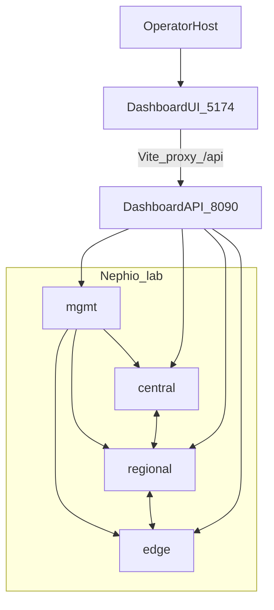
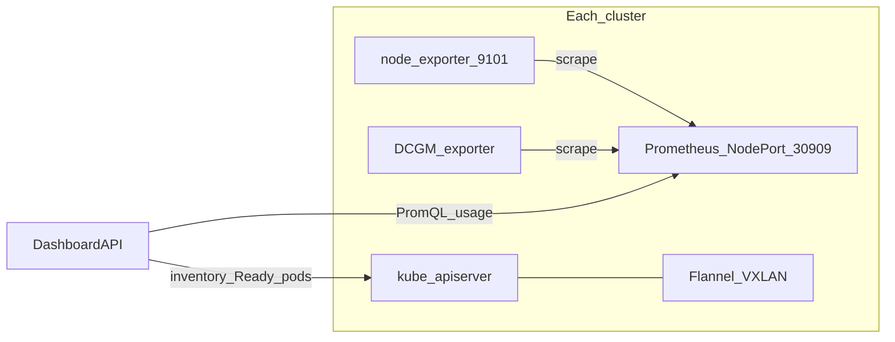
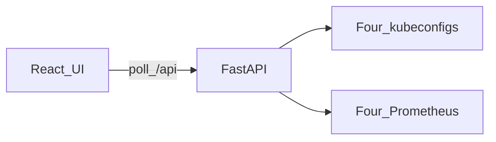

# Dashboard architecture

## Role

Operator-facing **INA-Infra / NeuroRAN** console for the Nephio lab’s four Kubernetes clusters. It is **not** the in-cluster Kubernetes Dashboard (NodePort `30443`).

This app runs on the **operator host** (any machine with the four kubeconfigs) and fans out to each cluster’s API server and Prometheus.

## Multi-cluster layout

Lab topology as shown in the React Flow map: **mgmt** above, site chain **central ↔ regional ↔ edge**.



| Cluster | Role | CP mgmt IP (SSH / NodePort) | K8s API / InternalIP plane | Context | Kubeconfig |
|---------|------|-----------------------------|----------------------------|---------|------------|
| **mgmt** | Nephio / lab control | `10.1.132.200` | same (mgmt plane) | `mgmt@mgmt` | `~/.kube/config` |
| **central** | Core / 5GC | `10.1.132.210` | `10.1.137.110` | `central@central` | `~/.kube/config-central` |
| **regional** | Regional RAN/UPF | `10.1.132.220` | `10.1.137.120` | `regional@regional` | `~/.kube/config-regional` |
| **edge** | Edge RAN / UEs / GPUs | `10.1.132.230` | `10.1.137.130` (+ `edge-2`/`edge-3`/`usrp`) | `edge@edge` | `~/.kube/config-edge` |

Site plane (`.137`) carries Kubernetes node identity and Flannel. Operator access and Prometheus **NodePort `30909`** use the CP **mgmt** IP (`.132`).

## Per-cluster stack

Each cluster is queried independently. There is **no** shared Prometheus hub.



| Concern | Source |
|---------|--------|
| Reachability, nodes, Ready, roles, capacity/allocatable | Kubernetes API |
| Pod phases, Deployment / StatefulSet counts | Kubernetes API |
| Topology graph + saved layout | API + `dashboard/data/topology_layout.json` |
| CPU / memory **usage** | Prometheus ← node_exporter |
| Physical NIC RX/TX + history | Prometheus ← `node_network_*` |
| GPU util / vRAM | Prometheus `DCGM_FI_DEV_*` (fallback: dcgm-exporter port-forward) |

GPU exporters exist on **central** / **edge** (GH200 workers). mgmt / regional typically have no DCGM series.

## Dashboard components

```text
dashboard/
  frontend/     Vite + React (:5174) — NeuroRAN shell, React Flow, Chart.js
  backend/      FastAPI (:8090) — multi-kubeconfig client + PromQL + Swagger
  docs/         Architecture, Prometheus, API, operations
  data/         Saved topology layout (local JSON)
```



### Frontend

- Polls the backend; selecting a **cluster** or **k8s node** drives the detail panel.
- Cluster click → aggregates + node table.
- Node click → CPU/mem/GPU gauges + physical NIC charts for that node.
- Topology edges: mgmt → {central, regional, edge}; central ↔ regional ↔ edge.
- Numbers are finite-checked so the UI never shows the string `NaN`.

### Backend

- Loads four kubeconfigs in parallel for inventory (see [operations.md](operations.md)).
- Prometheus base URL per cluster: `http://<CP_mgmt_IP>:30909` (overridable).
- Prom access order: **NodePort → apiserver service proxy → kubectl port-forward**.
- `/metrics` lists every k8s node; each has `sampled: true|false` for node_exporter coverage.

## Cross-node NodePort path

Hitting `http://10.1.132.230:30909` lands on **edge-0**. If Prometheus runs on **edge-2**, kube-proxy must forward across **Flannel**. Each node’s Flannel `public-ip` must be its kube **InternalIP** (site `.137`). Details: [prometheus.md](prometheus.md#edge-nodeport-and-flannel).

## Related

- Metrics stack and GitOps: [prometheus.md](prometheus.md)
- API: [api.md](api.md)
- Run / troubleshoot: [operations.md](operations.md)
- Lab IPs: [docs/testbed.md](../../docs/testbed.md), [docs/ip_plan.md](../../docs/ip_plan.md)
