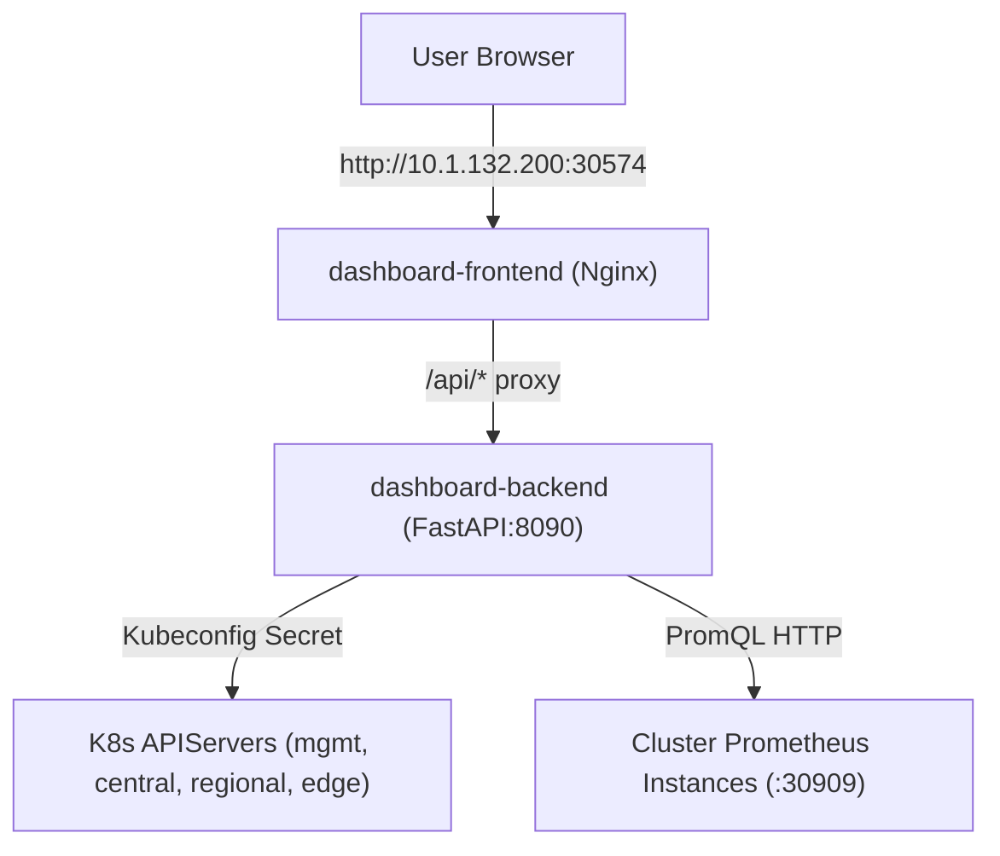

# Multi-Cluster Resource Dashboard — Kubernetes Deployment

This document covers running the **Multi-Cluster Ops & Resource Dashboard** inside the `mgmt` Kubernetes cluster.

---

## 1. Overview & Architecture

The in-cluster deployment packages both the **React Flow frontend** and **FastAPI backend** into containerized workloads running in the `dashboard` namespace on the `mgmt` cluster.



* **Frontend**: Nginx container serving the compiled React/Vite single-page app and reverse-proxying `/api/` to the backend service.
* **Backend**: FastAPI container mounting cluster kubeconfigs from a Kubernetes Secret (`dashboard-kubeconfigs`), querying each cluster's APIServer for live inventories, and scraping Prometheus for CPU, RAM, GPU util, and vRAM stats.

---

## 2. Endpoints & Access

| Component | Target URL | Protocol / Port | Type |
| :--- | :--- | :--- | :--- |
| **Web Console UI** | `http://10.1.132.200:30574/` | HTTP / NodePort `30574` | React Flow Topology + Charts |
| **Backend REST API** | `http://10.1.132.200:30574/api/v1/clusters` | HTTP / NodePort `30574` | FastAPI Endpoints |
| **Interactive Docs** | `http://10.1.132.200:30574/docs` | HTTP / NodePort `30574` | Swagger UI |

---

## 3. Directory & File Structure

* `dashboard/backend/Dockerfile` — Python 3.10 slim container for backend service.
* `dashboard/frontend/Dockerfile` — Multi-stage `node:20-alpine` build + `nginx:1.27-alpine` runtime.
* `dashboard/frontend/nginx.conf` — Nginx proxy configuration.
* `dashboard/deploy/k8s-dashboard.yaml` — Kubernetes manifests (Namespace, Deployments, Services).
* `dashboard/scripts/build-and-push.sh` — Builds images and pushes to `10.1.132.30:5000/dashboard/{backend,frontend}:latest`.
* `dashboard/scripts/deploy-k8s.sh` — Creates the `dashboard-kubeconfigs` secret and applies deployment manifests to `mgmt`.

---

## 4. GitOps Deployment Workflow (Recommended)

All dashboard workloads in the `mgmt` cluster are managed declaratively by Google Config Sync (`RootSync`).

### Step 1: Render GitOps Manifests
```bash
./scripts/render_multi_cluster_dashboard_gitops.sh
```
This renders the Kubernetes manifests and base64-encoded multi-cluster kubeconfig secret into `repos/mgmt/namespaces/dashboard/`.

### Step 2: Push to GitOps Repositories (Gitea + GitHub)
```bash
./bringup/03_push_to_git_repos/push_gitea_gitops.sh -m "feat(dashboard): update multi-cluster resource dashboard" mgmt
```

### Step 3: Verify Config Sync Reconciliation
```bash
kubectl --context=mgmt@mgmt -n config-management-system get rootsync
```

---

## 5. Direct Deployment & Ad-hoc Testing

For rapid local iteration outside of GitOps:
```bash
./dashboard/scripts/build-and-push.sh
./dashboard/scripts/deploy-k8s.sh
```

### Check Pod & Service Status
```bash
kubectl --context=mgmt@mgmt get all -n dashboard -o wide
```

### View Logs
```bash
# Backend logs
kubectl --context=mgmt@mgmt logs -n dashboard -l app.kubernetes.io/name=dashboard-backend -f

# Frontend logs
kubectl --context=mgmt@mgmt logs -n dashboard -l app.kubernetes.io/name=dashboard-frontend -f
```

---

## 5. Environment Variables & Configuration

The backend deployment (`deploy/k8s-dashboard.yaml`) configures cluster discovery via environment variables:

| Environment Variable | Value in Container | Purpose |
| :--- | :--- | :--- |
| `DASHBOARD_MGMT_KUBECONFIG` | `/root/.kube/config` | Context `mgmt@mgmt` |
| `DASHBOARD_CENTRAL_KUBECONFIG` | `/root/.kube/config-central` | Context `central@central` |
| `DASHBOARD_REGIONAL_KUBECONFIG` | `/root/.kube/config-regional` | Context `regional@regional` |
| `DASHBOARD_EDGE_KUBECONFIG` | `/root/.kube/config-edge` | Context `edge@edge` |
| `DASHBOARD_HOST` | `0.0.0.0` | Listen host |
| `DASHBOARD_PORT` | `8090` | Listen port |
