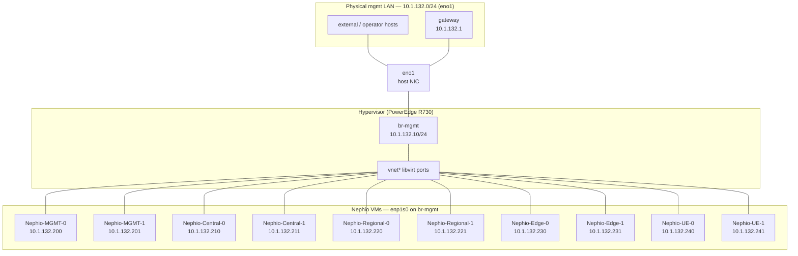
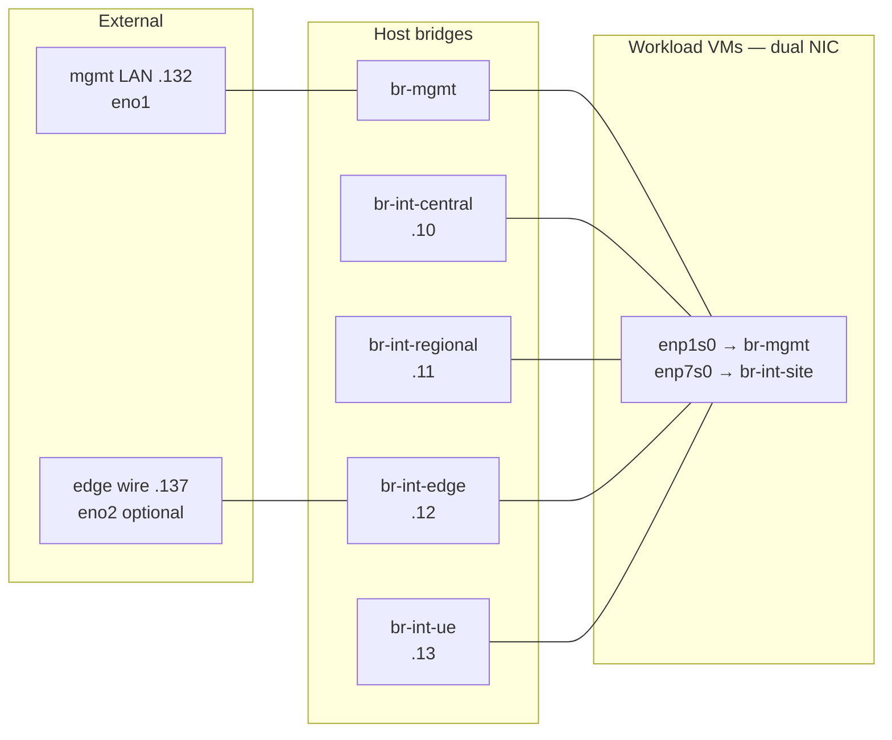

# Management network topology

Operator and cluster **mgmt** traffic uses **`10.1.132.0/24`** on guest **`enp1s0`**. Workload VMs reach that L2 via host bridge **`br-mgmt`**, with physical **`eno1`** enslaved directly as the uplink port.

Site / Kubernetes traffic stays on **`br-int-*`** via a second virtio NIC (`enp7s0`). See [ip.md](ip.md) and [bringup/00_testbed/readme.md](../bringup/00_testbed/readme.md).

## Host topology

**Subnet:** `10.1.132.0/24` on `br-mgmt` (guest `enp1s0`). Default route `via 10.1.132.1`; DNS `10.1.132.200` (Pi-hole on `mgmt-0`).



**Mgmt MetalLB VIPs** on the same L2 (`10.1.132.10`–`.99` pool): registry `.30`, OpenSpeedTest `.11`, Gitea `.200`, Nephio Web UI `.52`. See [ip.md](ip.md).

Each workload VM has **two** libvirt NICs:

| Guest NIC | Libvirt type | Host attachment | Addresses (example: central-0) |
|-----------|--------------|-----------------|----------------------------------|
| `enp1s0` | bridge | `br-mgmt` | `10.1.132.210/24` — SSH, default route, DNS, dashboard `:30443` |
| `enp7s0` | bridge | `br-int-<site>` | `10.1.137.110/24` + `10.1.138.110/24` — K8s API `:6443`, Flannel, MetalLB |

Inside the guest, mgmt is configured by [`utils/netplan/*/55-nephio-mgmt.yaml`](../utils/netplan/central-0/55-nephio-mgmt.yaml) (`enp1s0`, default `via 10.1.132.1`, DNS `10.1.132.200`). Deploy with [`scripts/setup_ip.sh`](../scripts/setup_ip.sh).

## Direct `eno1` on `br-mgmt`

Physical **`eno1`** is a **bridge port** on **`br-mgmt`** (no macvlan). VM mgmt NICs use libvirt **`bridge`** → `br-mgmt`, not **`direct`** → `eno1`.

**Requirement:** `eno1` must have **no macvtap/macvlan children**. All Nephio VM mgmt NICs attach to `br-mgmt` via `setup_mgmt_bridge.sh`.

Script: [`scripts/setup_mgmt_bridge.sh`](../scripts/setup_mgmt_bridge.sh).

| Host object | Role |
|-------------|------|
| `eno1` | Physical mgmt uplink (L2 bridge port, no IP) |
| `br-mgmt` | Linux bridge; host IP `10.1.132.10/24` + libvirt VM ports |
| `vnet*` | Per-VM virtio port on `br-mgmt` |

STP is **off** on `br-mgmt` (same as testbed `br-int-*` bridges).

## Bring up `br-mgmt`

```bash
cd scripts

# Full setup: remove legacy macvlan, enslave eno1, VM attach, verify
sudo ./setup_mgmt_bridge.sh

# Host bridge only (no libvirt attach)
sudo ./setup_mgmt_bridge.sh setup --no-vms

# Also push guest netplan (needs SSH to VMs)
sudo ./setup_mgmt_bridge.sh setup --apply-netplan

sudo ./setup_mgmt_bridge.sh status
sudo ./setup_mgmt_bridge.sh verify
sudo ./setup_mgmt_bridge.sh down
```

Default host IP on `br-mgmt`: **`10.1.132.10/24`** (migrated from `eno1` if it already held a `.132` address). Route **`10.1.132.0/24`** uses `br-mgmt`. Verify pings **`10.1.132.200`** (mgmt-0) and **`10.1.132.1`** (gateway).

## Attach VM mgmt NIC to `br-mgmt`

```bash
virsh attach-interface Nephio-Central-0 \
  --type bridge \
  --source br-mgmt \
  --model virtio \
  --mac 52:54:00:b0:84:4c \
  --config \
  --live
```

Repeat per VM (stable MACs match prior `direct eno1` attachments). Current attachments:

| VM | Mgmt IP (`enp1s0`) | `br-mgmt` port | MAC |
|----|--------------------|----------------|-----|
| Nephio-MGMT-0 | `10.1.132.200` | vnet230 | `52:54:00:bb:ee:cc` |
| Nephio-MGMT-1 | `10.1.132.201` | vnet229 | `52:54:00:ad:55:7e` |
| Nephio-Central-0 | `10.1.132.210` | vnet221 | `52:54:00:b0:84:4c` |
| Nephio-Central-1 | `10.1.132.211` | vnet223 | `52:54:00:7c:13:66` |
| Nephio-Regional-0 | `10.1.132.220` | vnet231 | `52:54:00:75:f6:a3` |
| Nephio-Regional-1 | `10.1.132.221` | vnet233 | `52:54:00:0a:8c:61` |
| Nephio-Edge-0 | `10.1.132.230` | vnet225 | `52:54:00:1b:63:b2` |
| Nephio-Edge-1 | `10.1.132.231` | vnet227 | `52:54:00:68:6a:dd` |
| Nephio-UE-0 | `10.1.132.240` | vnet235 | `52:54:00:9b:0e:bc` |
| Nephio-UE-1 | `10.1.132.241` | vnet237 | `52:54:00:dc:d6:54` |

Site NICs remain on `br-int-*` via [`bringup/00_testbed/attach_vm.sh`](../bringup/00_testbed/attach_vm.sh).

## Node addresses (mgmt / `enp1s0`)

| Cluster | Host | Mgmt IP (`enp1s0`) | Site `.137` (`enp7s0`) | Site `.138` (`enp7s0`) | Dashboard `:30443` |
|---------|------|--------------------|-------------------------|-------------------------|---------------------|
| mgmt | `mgmt-0` | `10.1.132.200` | — | — | `https://10.1.132.200:30443` |
| mgmt | `mgmt-1` | `10.1.132.201` | — | — | — |
| central | `central-0` | `10.1.132.210` | `10.1.137.110` | `10.1.138.110` | `https://10.1.132.210:30443` |
| central | `central-1` | `10.1.132.211` | `10.1.137.111` | `10.1.138.111` | — |
| regional | `regional-0` | `10.1.132.220` | `10.1.137.120` | `10.1.138.120` | `https://10.1.132.220:30443` |
| regional | `regional-1` | `10.1.132.221` | `10.1.137.121` | `10.1.138.121` | — |
| edge | `edge-0` | `10.1.132.230` | `10.1.137.130` | `10.1.138.130` | `https://10.1.132.230:30443` |
| edge | `edge-1` | `10.1.132.231` | `10.1.137.131` | `10.1.138.131` | — |
| ue | `ue-0` | `10.1.132.240` | `10.1.137.140` | `10.1.138.140` | `https://10.1.132.240:30443` |
| ue | `ue-1` | `10.1.132.241` | `10.1.137.141` | `10.1.138.141` | — |

K8s API (`:6443`) uses the **`.137`** address on control-plane nodes. Default route on all nodes: **`via 10.1.132.1`**. DNS: **`10.1.132.200`** (Pi-hole on `mgmt-0`).

Full VIP and pool tables: [ip.md](ip.md). SSH aliases: [`utils/ssh_config/config`](../utils/ssh_config/config).

## Verify

On the host:

```bash
sudo ./scripts/setup_mgmt_bridge.sh status
bridge link show dev br-mgmt
ip -br link show br-mgmt eno1

# Per-VM NICs
virsh domiflist Nephio-Central-0
```

From a VM (guest `enp1s0`):

```bash
ip -br addr show enp1s0
ping -c2 10.1.132.1
ping -c2 10.1.132.200
```

## Relation to site testbed

Each Nephio VM sits on **two planes**: mgmt (`enp1s0` on `br-mgmt`) and site (`enp7s0` on `br-int-<site>`). The hypervisor stitches physical wires, Linux bridges, libvirt `vnet*` ports, and guest NICs into one L2 path per plane.

```text
  EXTERNAL                    HOST                         GUEST VM
  ---------                   ----                         --------

  mgmt LAN (.132)  ── eno1 ── br-mgmt ── vnet* ── enp1s0  (SSH, route, dashboard)
  edge site (.137) ── eno2 ── br-int-edge ── vnet* ── enp7s0  (K8s, Flannel, MetalLB)
                                    │
                               vm-sw-edge ── br-ext-eu ── … (other sites)
```

### All sites on the host



Central / regional / UE site bridges are **host-internal** unless you add another physical uplink the same way as `eno2` → `br-int-edge`.

### Layer map

| Layer | Mgmt plane | Site plane (edge) |
|-------|------------|-------------------|
| **External** | `10.1.132.0/24` LAN, GW `10.1.132.1` | Optional L2 peer on `eno2` cable |
| **Physical** | `eno1` → enslaved to `br-mgmt` | `eno2` → enslaved to `br-int-edge` |
| **Host bridge** | `br-mgmt` (`10.1.132.10`) | `br-int-edge` (`10.1.137.12`) |
| **Libvirt** | `vnet*` on `br-mgmt` | `vnet*` on `br-int-edge` |
| **Guest NIC** | `enp1s0` (`.132.230` on edge-0) | `enp7s0` (`.137.130` + `.138.130`) |
| **Beyond site** | — | `vm-sw-edge` → `br-ext-eu` → UE tier |

| Plane | Host bridge | Physical NIC | Guest NIC | Subnets |
|-------|-------------|--------------|-----------|---------|
| **Mgmt** | `br-mgmt` | **`eno1`** | `enp1s0` (all VMs) | `10.1.132.0/24` |
| **Site (edge)** | `br-int-edge` | **`eno2`** (optional) | `enp7s0` (Edge VMs) | `10.1.137.0/24`, `10.1.138.0/24` |
| **Site (other)** | `br-int-central` / `regional` / `ue` | none (internal `vnet*` only) | `enp7s0` | `10.1.137.0/24`, `10.1.138.0/24` |

One NIC → one bridge. **`eno1` is for `br-mgmt` only.** Edge wire: [`scripts/br-int-edge_2_eno2.sh`](../scripts/br-int-edge_2_eno2.sh). Mgmt wire: [`scripts/setup_mgmt_bridge.sh`](../scripts/setup_mgmt_bridge.sh).

**edge-0:** mgmt `10.1.132.230` on `enp1s0` ← `br-mgmt` ← `eno1`; site `10.1.137.130` + `10.1.138.130` on `enp7s0` ← `br-int-edge` ← `eno2` (optional).

**central-0:** same mgmt path; site on `br-int-central` (`10.1.137.10/24`) — internal, no `eno2` by default.

Site interconnect (`br-int-*` → `vm-sw-*` → `br-ext-*`): [testbed readme](../bringup/00_testbed/readme.md).

## Persistence

`setup_mgmt_bridge.sh` and `br-int-edge_2_eno2.sh` are runtime-only. After reboot:

```bash
sudo ./scripts/setup_mgmt_bridge.sh up
sudo ./scripts/br-int-edge_2_eno2.sh setup   # if using eno2 wire uplink
```

Libvirt `--config` attachments survive reboot once the bridges exist.

## Related scripts

| Script | Purpose |
|--------|---------|
| [scripts/setup_mgmt_bridge.sh](../scripts/setup_mgmt_bridge.sh) | Create `br-mgmt`, enslave `eno1`, attach VMs |
| [scripts/br-int-edge_2_eno2.sh](../scripts/br-int-edge_2_eno2.sh) | Optional: enslave `eno2` to `br-int-edge` |
| [scripts/setup_ip.sh](../scripts/setup_ip.sh) | Push mgmt + site netplan to guests |
| [scripts/bringup_cluster.sh](../scripts/bringup_cluster.sh) | Kubernetes bootstrap (mgmt on `enp1s0`) |
| [bringup/00_testbed/attach_vm.sh](../bringup/00_testbed/attach_vm.sh) | Attach site NIC to `br-int-*` |
