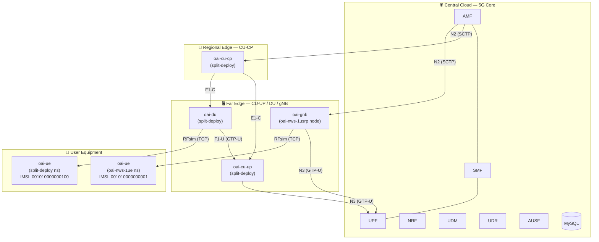

# OAI Split RAN Deployment Guide

This document describes the two 5G Standalone RAN deployments running on the shared 5G core, their IP plans, and operational procedures.

---

## 1. Architecture Overview

Two independent RAN slices share the single 5GC (`central-0`). Each has its own gNodeB and nrUE with distinct identifiers.



---

## 2. Deployment Summary

### 2a. `oai-ran-nephio-example-split-deploy` (Split RAN)

Full 3GPP F1/E1 split: CU-CP on `regional-0`, CU-UP + DU on `edge-0`, UE on `ue-0`.

| Component | Cluster | Namespace | Resources |
|---|---|---|---|
| 5GC | `central-0` | `oai-cn` / `oai-upf` | AMF, SMF, UPF, NRF, UDM, UDR, AUSF, MySQL |
| CU-CP | `regional-0` | `oai-ran-nephio-example-split-deploy` | `oai-cu-cp`, `oai-ran-operator` |
| CU-UP + DU | `edge-0` | `oai-ran-nephio-example-split-deploy` | `oai-cu-up`, `oai-du`, `oai-ran-operator` |
| UE | `ue-0` | `oai-ran-nephio-example-split-deploy` | `oai-ran-nephio-example-split-deploy` pod |

### 2b. `oai-nws-1ue` (Monolithic gNB)

Single monolithic gNodeB (`oai-gnb`) pinned to the physical `usrp` worker node of `edge-0`. UE on `ue-0`.

| Component | Cluster | Node | Namespace | Resources |
|---|---|---|---|---|
| gNB | `edge-0` | `usrp` | `oai-nws-1ue` | `oai-gnb` (macvlan `enp4s0f0`) |
| UE | `ue-0` | any | `oai-nws-1ue` | `oai-ue` (macvlan `enp7s0`) |

---

## 3. IP Plan

### 3a. 5GC (shared, `central-0`)

| NF | Interface | IP |
|---|---|---|
| AMF | N2 | `10.1.139.10` |
| UPF | N3 (GTP-U) | `10.1.139.11` |
| SMF | N4 (PFCP) | `10.1.139.12` |
| UPF | N4 (PFCP) | `10.1.139.13` |
| UPF | N6 (Internet) | `10.1.139.14` |

### 3b. `oai-ran-nephio-example-split-deploy` RAN IPs (`enp7s0`)

| NF | Cluster | Interface | IP |
|---|---|---|---|
| CU-CP | `regional-0` | N2 | `10.1.139.60` |
| CU-CP | `regional-0` | F1-C | `10.1.139.61` |
| CU-CP | `regional-0` | E1 | `10.1.139.62` |
| CU-UP | `edge-0` | E1 | `10.1.139.110` |
| CU-UP | `edge-0` | F1-U | `10.1.139.111` |
| CU-UP | `edge-0` | N3 | `10.1.139.112` |
| DU | `edge-0` | F1 | `10.1.139.113` |
| UE | `ue-0` | RFsim | `10.1.139.160` |

### 3c. `oai-nws-1ue` RAN IPs (different from split-deploy to avoid collision)

| NF | Node | Interface | IP | Master NIC |
|---|---|---|---|---|
| gNB | `usrp` | N2/N3 | `10.1.139.114` | `enp4s0f0` |
| UE | `ue-0` | RFsim | `10.1.139.161` | `enp7s0` |

> **Important**: The `usrp` node (physical hardware) uses `enp4s0f0` for site K8s (`10.1.137.134`) and macvlan, while all VM nodes (`edge-0`, `regional-0`, `ue-0`) use `enp7s0`. Netplan: [`workloads/netplan/usrp/55-k8s.yaml`](../workloads/netplan/usrp/55-k8s.yaml).

---

## 4. gNodeB Identity Parameters

Each gNB **must** have unique values across all three of these parameters to avoid AMF treating them as the same cell (which causes the newer gNB to evict the older one):

| Parameter | `oai-ran-nephio-example-split-deploy` (CU-CP) | `oai-nws-1ue` (gNB) |
|---|---|---|
| `gNB_ID` | `0xe00` | `0xe01` |
| `nr_cellid` | `12345678` | `12345679` |
| `physCellId` | `0` | `1` |
| `gNB_name` | `oai-cu-cp` | `gnb-rfsim` |

---

## 5. UE Subscriber Identity

| Namespace | IMSI | Key | OPC | DNN |
|---|---|---|---|---|
| `oai-ran-nephio-example-split-deploy` | `001010000000100` | `fec86ba6eb707ed08905757b1bb44b8f` | `C42449363BBAD02B66D16BC975D77CC1` | `internet` |
| `oai-nws-1ue` | `001010000000001` | `fec86ba6eb707ed08905757b1bb44b8f` | `C42449363BBAD02B66D16BC975D77CC1` | `internet` |

Both IMSIs are pre-provisioned in the MySQL UDR database.

---

## 6. User Plane Tunnel

When a UE successfully registers with the AMF and establishes a PDU session, a tunnel interface is created inside the UE container:

| Namespace | Tunnel Interface | UE IP | UPF Gateway |
|---|---|---|---|
| `oai-ran-nephio-example-split-deploy` | `oaitun_ue1` | `10.1.0.2` | `10.1.0.1` |
| `oai-nws-1ue` | `oaitun_ue1` | `10.1.0.x` (DHCP from pool) | `10.1.0.1` |

UE PDU addresses are NATed by the UPF N6 interface to reach external networks.

---

## 7. Known Issues & Workarounds

### SMF crash on PDU session request after restart

**Symptom**: SMF crashes with `No UPF available. SMF selection failed` immediately after restart if a PDU session request arrives before the UPF completes PFCP re-association.

**Cause**: The UPF re-registers via PFCP heartbeat (~10s after SMF restart). If the UE's PDU session request arrives within that window, the SMF fails to find a UPF and crashes.

**Workaround**: Restart the UPF first to force a clean PFCP re-association, wait ~15s for PFCP to establish, then restart the UE.

```bash
# 1. Restart UPF to force PFCP re-registration
ssh -F utils/ssh_config/config central-0 "kubectl -n oai-upf rollout restart deployment/upf-core"
sleep 20

# 2. Restart UE to re-trigger PDU session
ssh -F utils/ssh_config/config ue-0 "kubectl -n oai-nws-1ue rollout restart deployment/oai-ue"
```

### GTP-U MTU fragmentation causing TCP upload failures

**Symptom**: Download works but upload times out at 4 threads inside the UE pod.

**Cause**: GTP-U encapsulation adds overhead making effective MTU less than 1500.

**Workaround**: Lower the tunnel MTU to 1350.

```bash
ssh -F utils/ssh_config/config ue-0 "kubectl -n <namespace> exec deployment/<ue-deploy> -- ip link set dev oaitun_ue1 mtu 1350"
```

### gNB ID conflict causing UE registration failures

**Symptom**: Two gNBs with identical `gNB_ID` cause the AMF to evict the older connection. The affected UE may show `5GMM-REGISTERED` at the AMF but the PDU session never arrives at the SMF.

**Fix**: Assign unique `gNB_ID`, `nr_cellid`, and `physCellId` to each gNB (see Section 4).

---

## 8. Verification Commands

### Check AMF status (all gNBs and UEs)
```bash
ssh -F utils/ssh_config/config central-0 "kubectl -n oai-cn logs deployment/amf-core --tail=30 | grep -E 'gNB|IMSI|Connected|REGISTERED'"
```

Expected: **2 gNBs Connected** (`oai-cu-cp` @ `0xe000`, `gnb-rfsim` @ `0xe010`) and **2 UEs 5GMM-REGISTERED**.

### Check UE tunnel interface
```bash
# Split-deploy UE
ssh -F utils/ssh_config/config ue-0 "kubectl -n oai-ran-nephio-example-split-deploy exec deployment/oai-ran-nephio-example-split-deploy -- ip addr show oaitun_ue1"

# oai-nws-1ue UE
ssh -F utils/ssh_config/config ue-0 "kubectl -n oai-nws-1ue exec deployment/oai-ue -- ip addr show oaitun_ue1"
```

### Run OpenSpeedTest from split-deploy UE
```bash
# Copy script (first time or after pod restart)
scp -F utils/ssh_config/config utils/openspeedtest/speedtest.py ue-0:/tmp/speedtest.py
ssh -F utils/ssh_config/config ue-0 "kubectl cp -n oai-ran-nephio-example-split-deploy /tmp/speedtest.py \$(kubectl get pods -n oai-ran-nephio-example-split-deploy -l app.kubernetes.io/name=oai-ran-nephio-example-split-deploy -o jsonpath='{.items[0].metadata.name}'):/tmp/speedtest.py"

# Add route, lower MTU, run test
ssh -F utils/ssh_config/config ue-0 "kubectl -n oai-ran-nephio-example-split-deploy exec deployment/oai-ran-nephio-example-split-deploy -- ip route add 10.1.132.11 dev oaitun_ue1 || true"
ssh -F utils/ssh_config/config ue-0 "kubectl -n oai-ran-nephio-example-split-deploy exec deployment/oai-ran-nephio-example-split-deploy -- ip link set dev oaitun_ue1 mtu 1350"
ssh -F utils/ssh_config/config ue-0 "kubectl -n oai-ran-nephio-example-split-deploy exec deployment/oai-ran-nephio-example-split-deploy -- python3 /tmp/speedtest.py --server http://10.1.132.11/ --bind 10.1.0.2 --duration 10 --threads 1"
```

> **Note**: Use `--threads 1` on the mobile link. Multiple threads saturate the RFsim buffer and cause TCP upload timeouts.
