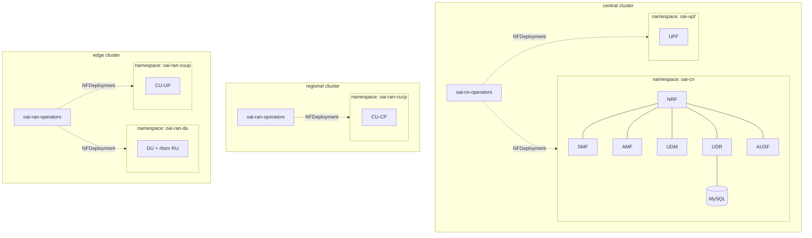
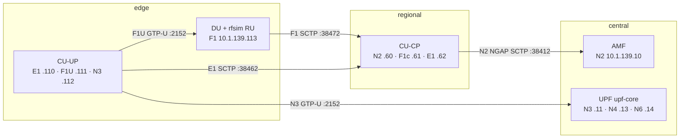
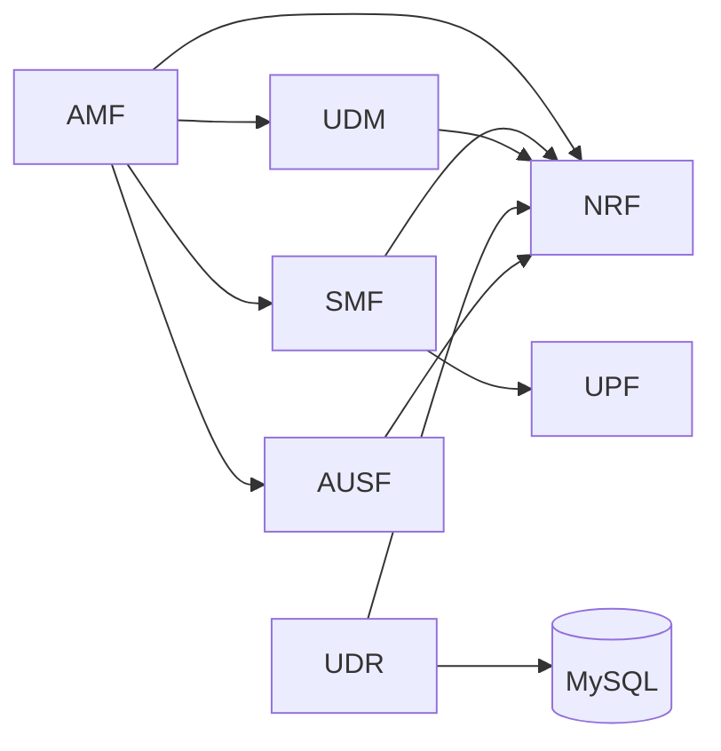
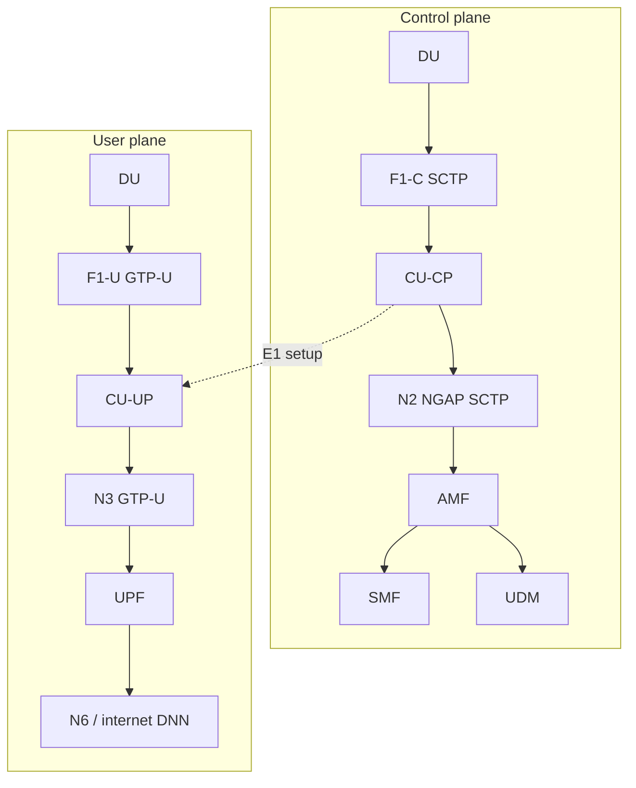

# OAI topology

OpenAirInterface 5G deployment across three workload clusters: **central** (5GC + UPF), **regional** (CU-CP), **edge** (DU + rfsim RU + CU-UP). All manifests are GitOps via Config Sync ([ip.md](ip.md) for addressing).

## OAI macvlan IP plan (`10.1.139.0/24`)

Untagged **macvlan** on `enp7s0` (Multus NADs). **No host/netplan IP** on `.139` — only OAI pod interfaces. Logical gateway for NAD config: **`10.1.139.1`**. `10.1.138.0/24` stays for MetalLB / OpenSpeedTest only.

**Range `10.1.139.10` – `10.1.139.209`:** four workload clusters × **50 IPs** each (`mgmt` is not on this network). Each cluster assigns macvlan IPs from **`base + 0`** upward. **Deployed today:** 1 CU-CP on **regional**, 1 CU-UP + 1 DU on **edge**, 5GC on **central**.

| Cluster | Base | Range | Deployed |
|---------|------|-------|----------|
| central | `.10` | `10.1.139.10` – `10.1.139.59` | 1× AMF, 1× SMF, 1× UPF |
| regional | `.60` | `10.1.139.60` – `10.1.139.109` | **1× CU-CP** |
| edge | `.110` | `10.1.139.110` – `10.1.139.159` | **1× CU-UP + 1× DU** |
| ue | `.160` | `10.1.139.160` – `10.1.139.209` | — (reserved) |

### Deployed RAN (3 NFs)

| NF | Cluster | IPs (macvlan on `10.1.139.0/24`) |
|----|---------|-------------------------------------|
| **CU-CP** | regional | N2 `10.1.139.60` · F1-C `10.1.139.61` · E1 `10.1.139.62` |
| **CU-UP** | edge | E1 `10.1.139.110` · F1-U `10.1.139.111` · N3 `10.1.139.112` |
| **DU** | edge | F1 `10.1.139.113` |

### Deployed 5GC (central)

One **AMF**, one **SMF**, one **UPF** (`upf-core` — three macvlan interfaces).

| NF | Offset | Interface | IP |
|----|--------|-----------|-----|
| AMF | `+0` | N2 | `10.1.139.10` |
| UPF (`upf-core`) | `+1` | N3 | `10.1.139.11` |
| SMF | `+2` | N4 | `10.1.139.12` |
| UPF (`upf-core`) | `+3` | N4 | `10.1.139.13` |
| UPF (`upf-core`) | `+4` | N6 | `10.1.139.14` |

### Cross-cluster peer pairs

```
regional CU-CP N2   10.1.139.60   ──SCTP──►  AMF N2      10.1.139.10   (central)
edge DU F1          10.1.139.113  ──SCTP──►  CU-CP F1-C  10.1.139.61   (regional)
edge CU-UP E1       10.1.139.110  ──SCTP──►  CU-CP E1    10.1.139.62   (regional)
edge CU-UP N3       10.1.139.112  ──GTP-U──►  UPF N3      10.1.139.11   (central)
central SMF N4      10.1.139.12   ──PFCP──►  UPF N4      10.1.139.13   (central)
```

NRF / UDR / SMF SBI stay **ClusterIP** inside `oai-cn` (unchanged). DNN pool behind UPF N6 stays **`10.1.0.0/24`**.

### Slice offsets

**Rule:** `IP = cluster_base + offset`. Offsets always count from **`+0`** within each cluster slice (no gaps, no `+10` block).

**central** (base `10.1.139.10`) — 1× AMF, 1× SMF, 1× UPF (`upf-core`)

| Offset | NF | Interface | IP |
|--------|-----|-----------|-----|
| `+0` | AMF | N2 | `10.1.139.10` |
| `+1` | UPF | N3 | `10.1.139.11` |
| `+2` | SMF | N4 | `10.1.139.12` |
| `+3` | UPF | N4 | `10.1.139.13` |
| `+4` | UPF | N6 | `10.1.139.14` |
| `+5` – `+49` | — | reserved | |

Offsets `+1`, `+3`, `+4` are on the same **`upf-core`** pod (N3 / N4 / N6). SMF N4 at `+2` is a separate pod.

**regional** (base `10.1.139.60`)

| Offset | NF | Interface | IP |
|--------|-----|-----------|-----|
| `+0` | CU-CP | N2 | `10.1.139.60` |
| `+1` | CU-CP | F1-C | `10.1.139.61` |
| `+2` | CU-CP | E1 | `10.1.139.62` |
| `+3` – `+49` | — | reserved | |

**edge** (base `10.1.139.110`)

| Offset | NF | Interface | IP |
|--------|-----|-----------|-----|
| `+0` | CU-UP | E1 | `10.1.139.110` |
| `+1` | CU-UP | F1-U | `10.1.139.111` |
| `+2` | CU-UP | N3 | `10.1.139.112` |
| `+3` | DU | F1 | `10.1.139.113` |
| `+4` – `+49` | — | reserved | |

**ue** (base `10.1.139.160`) — entire slice reserved (`+0` – `+49`).

When a cluster later runs a full RAN trio (1 CU-CP + 1 CU-UP + 1 DU), continue assigning from `+0` in interface order: CU-CP N2/F1-C/E1 (`+0`–`+2`), CU-UP E1/F1-U/N3 (`+3`–`+5`), DU F1 (`+6`).

## Cluster placement



| Cluster | Components | Namespaces |
|---------|------------|------------|
| **central** | NRF, AMF, SMF, UDM, UDR, AUSF, MySQL, UPF | `oai-cn`, `oai-upf`, `oai-cn-operators` |
| **regional** | CU-CP | `oai-ran-cucp`, `oai-ran-operators` |
| **edge** | DU (rfsim RU), CU-UP | `oai-ran-du`, `oai-ran-cuup`, `oai-ran-operators` |

## RAN split (DU / CU-CP / CU-UP)



CU-CP is the control-plane anchor: it terminates **N2** toward the core, **F1-C** toward the DU, and **E1** toward the CU-UP. CU-UP handles the user plane (**F1-U** to DU, **N3** to UPF).

## 5GC service-based interfaces (central only)

Internal **ClusterIP** services inside `oai-cn` — no MetalLB VIP:



| NF | K8s service | Access |
|----|-------------|--------|
| NRF | `oai-nrf.oai-cn.svc` | ClusterIP (SBI HTTP/2) |
| AMF | `oai-amf.oai-cn.svc` | ClusterIP headless (SBI); N2 is macvlan |
| SMF | `oai-smf.oai-cn.svc` | ClusterIP headless |
| UDM | `oai-udm.oai-cn.svc` | ClusterIP headless |
| UDR | `oai-udr.oai-cn.svc` | ClusterIP headless |
| AUSF | `oai-ausf.oai-cn.svc` | ClusterIP headless |

## Interface addressing

All OAI data-plane interfaces use Multus **macvlan** on `enp7s0` in **`10.1.139.0/24`** (see [IP plan](#oai-macvlan-ip-plan-101139024) above). Gateway in NAD config: **`10.1.139.1`**. No host netplan address on `.139`.

| Link | Protocol | Local | Remote | Cluster(s) |
|------|----------|-------|--------|------------|
| **N2** (gNB ↔ AMF) | SCTP :38412 | CU-CP `10.1.139.60` | AMF `10.1.139.10` | regional → central |
| **F1-C** (DU ↔ CU-CP) | SCTP :38472 | DU `10.1.139.113` | CU-CP `10.1.139.61` | edge → regional |
| **E1** (CU-UP ↔ CU-CP) | SCTP :38462 | CU-UP `10.1.139.110` | CU-CP `10.1.139.62` | edge → regional |
| **F1-U** (CU-UP ↔ DU) | GTP-U :2152 | CU-UP `10.1.139.111` | DU (via CU-CP) | edge |
| **N3** (CU-UP ↔ UPF) | GTP-U :2152 | CU-UP `10.1.139.112` | UPF `10.1.139.11` | edge → central |
| **N4** (SMF ↔ UPF) | PFCP :8805 | SMF `10.1.139.12` | UPF `10.1.139.13` | central |
| **N6** (UPF ↔ data net) | IP | UPF `10.1.139.14` | DNN pool `10.1.0.0/24` | central |

Cross-cluster traffic uses the site L2 fabric (`enp7s0` → vm-sw), not Kubernetes pod networking. SBI between 5GC NFs stays **ClusterIP** inside `oai-cn`. MetalLB / OpenSpeedTest remain on **`10.1.138.0/24`** only ([ip.md](ip.md)).

## Control vs user plane



## Images

| Component | Image | Cluster |
|-----------|-------|---------|
| CU-CP | `oaisoftwarealliance/oai-gnb:v2.3.0` | regional |
| DU | `oaisoftwarealliance/oai-gnb:v2.3.0` (rfsim RU) | edge |
| CU-UP | `oaisoftwarealliance/oai-nr-cuup:v2.3.0` | edge |
| AMF | `oaisoftwarealliance/oai-amf:v2.0.1` | central |
| RAN operator | `nephio/oai-ran-controller:latest` | regional, edge |
| CN operators | OAI upstream controllers | central |

PLMN: **MCC 001 / MNC 01**, SST **1**, SD **ffffff**, DNN **internet**.

## GitOps render scripts

| Scope | Script |
|-------|--------|
| CN operators (central) | [scripts/render_oai_operators_gitops.sh](../scripts/render_oai_operators_gitops.sh) |
| 5GC NFs + UPF (central) | [scripts/render_oai_core_gitops.sh](../scripts/render_oai_core_gitops.sh) |
| CU-CP (regional) | [scripts/render_oai_ran_gitops.sh](../scripts/render_oai_ran_gitops.sh) |
| DU + rfsim (edge) | [scripts/render_oai_ran_du_gitops.sh](../scripts/render_oai_ran_du_gitops.sh) |
| CU-UP (edge) | [scripts/render_oai_ran_cuup_gitops.sh](../scripts/render_oai_ran_cuup_gitops.sh) |
| Multus CNI | [scripts/render_multus_gitops.sh](../scripts/render_multus_gitops.sh) |
| Push to Gitea | [bringup/03_push_to_git_repos/push_git_repos.sh](../bringup/03_push_to_git_repos/push_git_repos.sh) |

**Executor pattern:** RAN workloads (CU-CP, DU, CU-UP) use static executor manifests in git (Deployment, ConfigMap, NADs) because Config Sync prunes operator-created pods. Core NFs on central are reconciled by OAI CN operators from `NFDeployment` CRs.

## Quick health checks

```bash
# AMF gNB table (expect oai-cu-cp Connected)
ssh central-0 kubectl logs -n oai-cn -l workload.nephio.org/oai=amf --tail=30

# CU-CP NGAP + F1 + E1
ssh regional-0 kubectl logs -n oai-ran-cucp -l app.kubernetes.io/name=oai-cu-cp --tail=30

# DU rfsim + F1
ssh edge-0 kubectl logs -n oai-ran-du -l app.kubernetes.io/name=oai-du --tail=30

# CU-UP E1 / GTP-U
ssh edge-0 kubectl logs -n oai-ran-cuup -l app.kubernetes.io/name=oai-cu-up --tail=30
```
