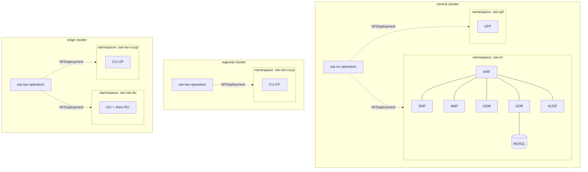
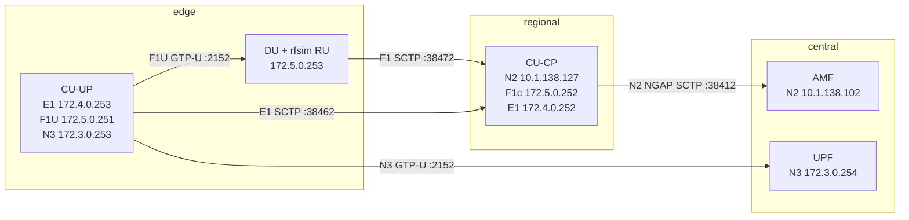
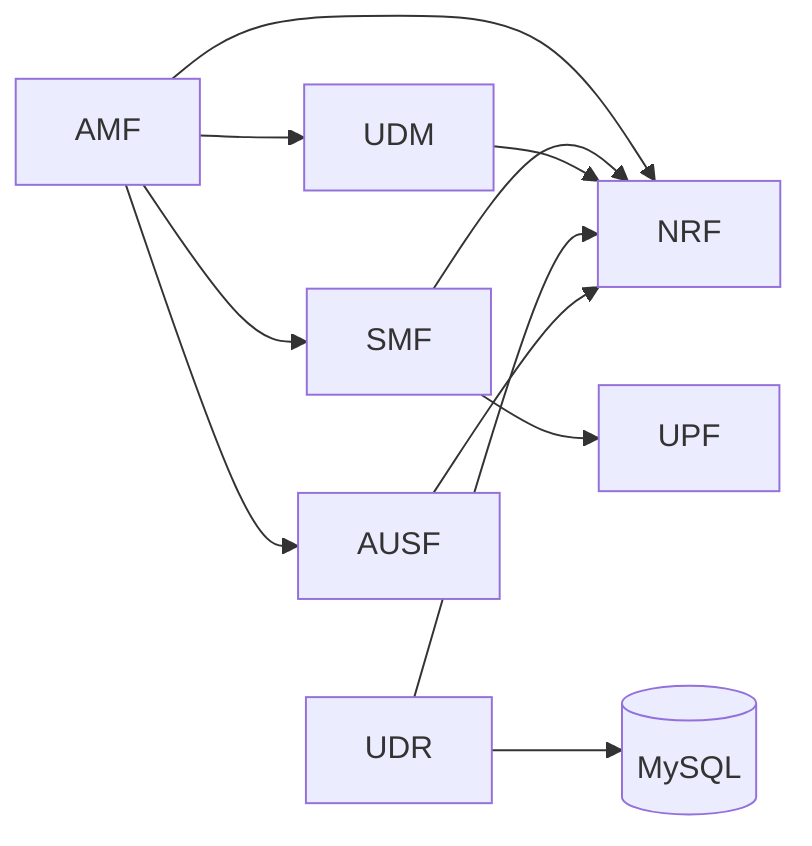
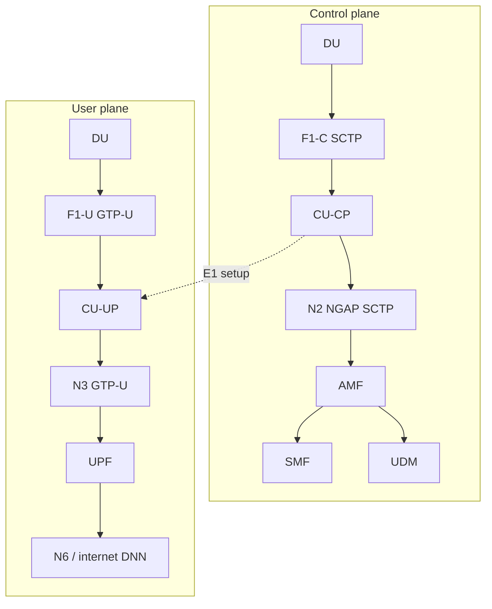

# OAI topology

OpenAirInterface 5G deployment across three workload clusters: **central** (5GC + UPF), **regional** (CU-CP), **edge** (DU + rfsim RU + CU-UP). All manifests are GitOps via Config Sync ([ip.md](ip.md) for addressing).

## Cluster placement



| Cluster | Components | Namespaces |
|---------|------------|------------|
| **central** | NRF, AMF, SMF, UDM, UDR, AUSF, MySQL, UPF | `oai-cn`, `oai-upf`, `oai-cn-operators` |
| **regional** | CU-CP | `oai-ran-cucp`, `oai-ran-operators` |
| **edge** | DU (rfsim RU), CU-UP | `oai-ran-du`, `oai-ran-cuup`, `oai-ran-operators` |

## RAN split (DU / CU-CP / CU-UP)



CU-CP is the control-plane anchor: it terminates **N2** toward the core, **F1-C** toward the DU, and **E1** toward the CU-UP. CU-UP handles the user plane (**F1-U** to DU, **N3** to UPF).

## 5GC service-based interfaces (central only)

Internal **ClusterIP** services inside `oai-cn` — no MetalLB VIP:



| NF | K8s service | Access |
|----|-------------|--------|
| NRF | `oai-nrf.oai-cn.svc` | ClusterIP (SBI HTTP/2) |
| AMF | `oai-amf.oai-cn.svc` | ClusterIP headless (SBI); N2 is macvlan |
| SMF | `oai-smf.oai-cn.svc` | ClusterIP headless |
| UDM | `oai-udm.oai-cn.svc` | ClusterIP headless |
| UDR | `oai-udr.oai-cn.svc` | ClusterIP headless |
| AUSF | `oai-ausf.oai-cn.svc` | ClusterIP headless |

## Interface addressing

Multus **macvlan** on `enp7s0` attaches RAN/CN data-plane interfaces. Site L2 (`10.1.138.0/24`) carries N2; private `172.x` subnets carry F1/E1/N3.

| Link | Protocol | Local | Remote | Cluster(s) |
|------|----------|-------|--------|------------|
| **N2** (gNB ↔ AMF) | SCTP :38412 | CU-CP `10.1.138.127` | AMF `10.1.138.102` | regional → central |
| **F1-C** (DU ↔ CU-CP) | SCTP :38472 | DU `172.5.0.253` | CU-CP `172.5.0.252` | edge → regional |
| **E1** (CU-UP ↔ CU-CP) | SCTP :38462 | CU-UP `172.4.0.253` | CU-CP `172.4.0.252` | edge → regional |
| **F1-U** (CU-UP ↔ DU) | GTP-U :2152 | CU-UP `172.5.0.251` | DU (via CU-CP) | edge |
| **N3** (CU-UP ↔ UPF) | GTP-U :2152 | CU-UP `172.3.0.253` | UPF `172.3.0.254` | edge → central |
| **N4** (SMF ↔ UPF) | PFCP | UPF `172.1.1.253` | SMF (ClusterIP) | central |
| **N6** (UPF ↔ data net) | IP | UPF `172.0.1.254` | DNN pool `10.1.0.0/24` | central |

Gateways on macvlan subnets use `.1` (e.g. `10.1.138.1`, `172.5.0.1`).

### Site VIPs (`10.1.138.0/24`)

| VIP | Role |
|-----|------|
| `10.1.138.101` | OpenSpeedTest (central) |
| `10.1.138.102` | AMF N2 |
| `10.1.138.103` | UPF N3 (MetalLB; UPF pod also uses macvlan `172.3.0.254`) |
| `10.1.138.126` | OpenSpeedTest (regional) |
| `10.1.138.127` | CU-CP N2 |
| `10.1.138.151` | OpenSpeedTest (edge) |

## Control vs user plane



## Images

| Component | Image | Cluster |
|-----------|-------|---------|
| CU-CP | `oaisoftwarealliance/oai-gnb:v2.3.0` | regional |
| DU | `oaisoftwarealliance/oai-gnb:v2.3.0` (rfsim RU) | edge |
| CU-UP | `oaisoftwarealliance/oai-nr-cuup:v2.3.0` | edge |
| AMF | `oaisoftwarealliance/oai-amf:v2.0.1` | central |
| RAN operator | `nephio/oai-ran-controller:latest` | regional, edge |
| CN operators | OAI upstream controllers | central |

PLMN: **MCC 001 / MNC 01**, SST **1**, SD **ffffff**, DNN **internet**.

## GitOps render scripts

| Scope | Script |
|-------|--------|
| CN operators (central) | [scripts/render_oai_operators_gitops.sh](../scripts/render_oai_operators_gitops.sh) |
| 5GC NFs + UPF (central) | [scripts/render_oai_core_gitops.sh](../scripts/render_oai_core_gitops.sh) |
| CU-CP (regional) | [scripts/render_oai_ran_gitops.sh](../scripts/render_oai_ran_gitops.sh) |
| DU + rfsim (edge) | [scripts/render_oai_ran_du_gitops.sh](../scripts/render_oai_ran_du_gitops.sh) |
| CU-UP (edge) | [scripts/render_oai_ran_cuup_gitops.sh](../scripts/render_oai_ran_cuup_gitops.sh) |
| Multus CNI | [scripts/render_multus_gitops.sh](../scripts/render_multus_gitops.sh) |
| Push to Gitea | [bringup/03_push_to_git_repos/push_git_repos.sh](../bringup/03_push_to_git_repos/push_git_repos.sh) |

**Executor pattern:** RAN workloads (CU-CP, DU, CU-UP) use static executor manifests in git (Deployment, ConfigMap, NADs) because Config Sync prunes operator-created pods. Core NFs on central are reconciled by OAI CN operators from `NFDeployment` CRs.

## Quick health checks

```bash
# AMF gNB table (expect oai-cu-cp Connected)
ssh central-0 kubectl logs -n oai-cn -l workload.nephio.org/oai=amf --tail=30

# CU-CP NGAP + F1 + E1
ssh regional-0 kubectl logs -n oai-ran-cucp -l app.kubernetes.io/name=oai-cu-cp --tail=30

# DU rfsim + F1
ssh edge-0 kubectl logs -n oai-ran-du -l app.kubernetes.io/name=oai-du --tail=30

# CU-UP E1 / GTP-U
ssh edge-0 kubectl logs -n oai-ran-cuup -l app.kubernetes.io/name=oai-cu-up --tail=30
```
