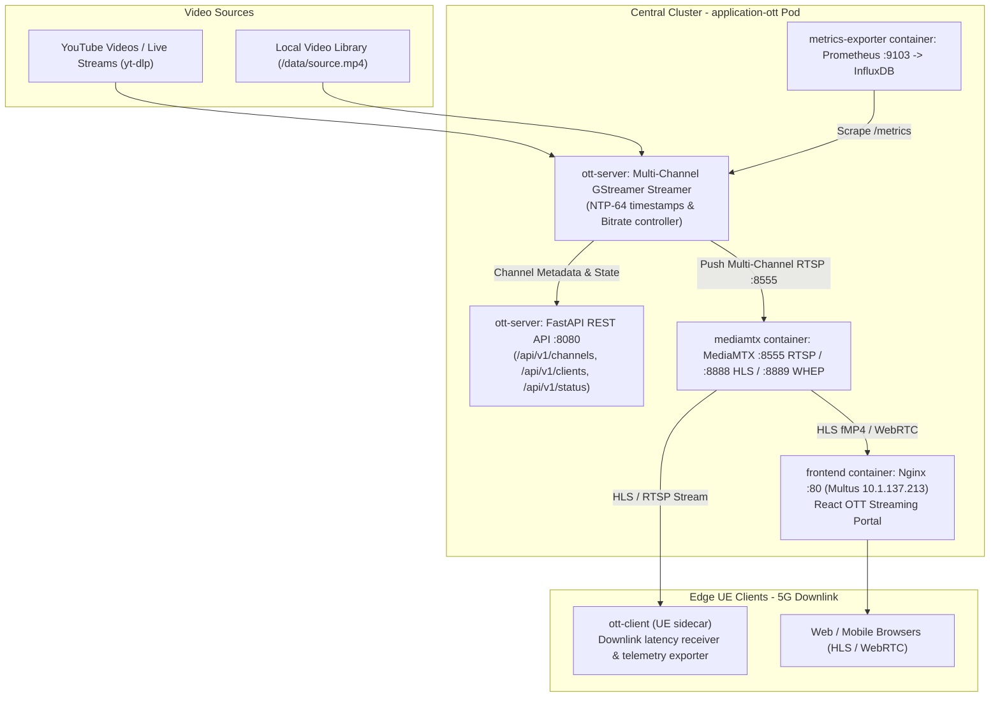

# OTT Video Streaming & 5G UE Reception Console (Slice 3)

## 1. Overview & Architecture

The **OTT Application (`application-ott`)** is a multi-channel High-Definition & 4K video streaming platform designed for **Slice 3 (Downlink High-Throughput & Low-Latency Video)**.

It provides:
1. **YouTube Video & Stream Ingest**: Dynamic YouTube streaming on demand (`yt-dlp`) plus pre-bundled high-definition video clips.
2. **Multi-Channel MediaMTX Pub/Sub**: Ingests multiple video channels and broadcasts them over low-latency **HLS (fMP4)** and **WebRTC WHEP**.
3. **Connected UE Management Console**: Lists all connected 5G UEs with real-time downlink KPIs (Network Transit Latency, RX FPS, RX Bitrate, Dropped Frames).
4. **Independent Start/Stop Controls**: Operators can start, stop, or re-route video streaming to individual UEs separately from the web console.
5. **Modern React Video Portal**: Broadcast-grade UI featuring a Theater Mode Player, Multi-Channel Video Wall, and YouTube Stream Loader.



---

## 2. Multi-Container Pod Architecture

| Container | Image | Ports / Roles |
|---|---|---|
| `ott-server` | `10.1.132.30:5000/application-ott:nws-v0.9-amd64` | `:8080` (REST API), `:8554` (RTSP PLAY), `:9103` (Prometheus) |
| `mediamtx` | `docker.io/bluenviron/mediamtx:1.12.2` | `:8555` (RTSP Publish), `:8888` (HLS), `:8889` (WebRTC), `:9997` (API) |
| `frontend` | `10.1.132.30:5000/application-ott-frontend:nws-v0.9-amd64` | `:80` (Nginx + React SPA on Multus `10.1.137.213`) |
| `metrics-exporter` | `docker.io/nicolaka/netshoot` | Scrapes `:9103` $\rightarrow$ InfluxDB `:8086` |

---

## 3. Connected UE Management & Remote Control

### Endpoints:
- `GET /api/v1/clients`: Lists all connected UEs, their active state (`STREAMING`, `STOPPED`, `IDLE`), assigned channel, and live downlink telemetry.
- `POST /api/v1/clients/{client_id}/start`: Commands a specific UE to begin streaming video downlink.
- `POST /api/v1/clients/{client_id}/stop`: Commands a specific UE to stop streaming video downlink.
- `POST /api/v1/clients/{client_id}/channel`: Re-routes a specific channel (or YouTube stream) to that UE.
- `POST /api/v1/clients/heartbeat`: Heartbeat from UE sidecars reporting per-frame latency and pulling desired state.

---

## 4. YouTube Video Ingest & Channels

### Default Channels:
1. `channel_1`: 4K City Drone (YouTube / Ultra HD)
2. `channel_2`: Nature & Wildlife (YouTube / 1080p)
3. `channel_3`: Cyberpunk Tech (YouTube / 60 FPS)
4. `channel_4`: Big Buck Bunny (Local HD Benchmark)

### Dynamic YouTube Ingest:
Send a `POST /api/v1/channels/{channel_id}/play` with:
```json
{
  "youtube_url": "https://www.youtube.com/watch?v=1La4QzGeaaQ",
  "title": "4K Cinematic Tokyo"
}
```
The backend uses `yt-dlp` to resolve the direct progressive stream and immediately switches the channel without interrupting other channels or UEs.

---

## 5. UI Portal Features

- **🎮 UE Console**: Interactive table of connected UEs with independent **Start / Stop** buttons, channel selectors, and live 5G downlink telemetry badges.
- **📺 Theater Player**: High-definition HLS video player with channel switcher sidebar and live HUD.
- **🎛️ Video Wall**: Multi-channel grid wall with lazy `IntersectionObserver` video decoders.
- **+ Add YouTube Stream**: Modal to enter any YouTube URL and stream it live.
