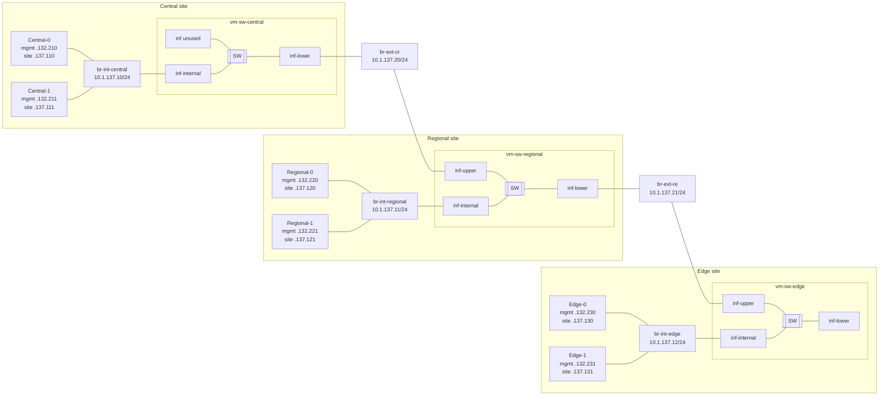

# Testbed topology

Workload VMs have two NICs: **mgmt** on `enp1s0` (`10.1.132.0/24`, SSH/default route) and **site** on `enp7s0` with two subnets on the same L2 (`br-int-*`): **`10.1.137.0/24`** (Kubernetes API, node traffic, Flannel) and **`10.1.138.0/24`** (MetalLB LoadBalancer VIPs). Configure with [`scripts/setup_ip.sh`](../scripts/setup_ip.sh).

**Physical uplinks:** hypervisor **`eno1`** carries **802.1Q VLANs** to join clusters to external L2 — **`eno1.132` → `br-mgmt`** (all clusters), **`eno1.135` → central**, **`eno1.136` → regional**, **`eno1.137` → edge**. See [bringup/00_testbed/readme.md](../bringup/00_testbed/readme.md) and [docs/topology.md](topology.md).

**Mgmt:** `mgmt-0`/`mgmt-1` @ `10.1.132.200`/`201` (Pi-hole, Nephio mgmt cluster); workload nodes use `+10` blocks on `enp1s0` for SSH only. Default route on all nodes: `via 10.1.132.1`; DNS: `10.1.132.200`.

**Kubernetes clusters** (API and node identity on site `enp7s0`; bring up with [`scripts/bringup_cluster.sh`](../scripts/bringup_cluster.sh), dashboard via GitOps [`scripts/render_dashboard_gitops.sh`](../scripts/render_dashboard_gitops.sh), operator access with [`scripts/kubectl_forward.sh`](../scripts/kubectl_forward.sh), login token with [`scripts/get_dashboard_key.sh`](../scripts/get_dashboard_key.sh), terminal UI with [`scripts/install_k9s.sh`](../scripts/install_k9s.sh)):

| Cluster | Control plane | Worker | SSH (mgmt) | API (`:6443`, `.137`) | Dashboard (132) | OpenSpeedTest (`.138`) | Context | Kubeconfig |
|---------|---------------|--------|------------|------------------------|-----------------|-------------------------|---------|------------|
| mgmt | `mgmt-0` `10.1.132.200` | `mgmt-1` `10.1.132.201` | same | `https://10.1.132.200:6443` | `https://10.1.132.200:30443` · fwd `:8443` | `http://10.1.132.11` | `mgmt@mgmt` | `~/.kube/config` |
| central | `central-0` `10.1.137.110` | `central-1` `10.1.137.111` | `.132.210`/`.211` | `https://10.1.137.110:6443` | `https://10.1.132.210:30443` · fwd `:8443` | `http://10.1.137.101` | `central@central` | `~/.kube/config-central` |
| regional | `regional-0` `10.1.137.120` | `regional-1` `10.1.137.121` | `.132.220`/`.221` | `https://10.1.137.120:6443` | `https://10.1.132.220:30443` · fwd `:8443` | `http://10.1.137.102` | `regional@regional` | `~/.kube/config-regional` |
| edge | `edge-0` `10.1.137.130` | `edge-1` `10.1.137.131` (+ physical `edge-2`/`edge-3`/`usrp`) | `.132.230`/`.231` | `https://10.1.137.130:6443` | `https://10.1.132.230:30443` · fwd `:8443` | `http://10.1.137.103` | `edge@edge` | `~/.kube/config-edge` |

**Physical edge workers** (VLAN 137; netplan [`workloads/netplan/*/55-k8s.yaml`](../workloads/netplan/)): `edge-2` `10.1.137.132` (`eno1`), `edge-3` `10.1.137.133` (`ens12f0`), `usrp` `10.1.137.134` (`enp4s0f0`). SSH: see [`utils/ssh_config/config`](../utils/ssh_config/config). Detail: [ip_plan.md](ip_plan.md) · [docs/topology.md](topology.md).

**Dashboard:** all clusters use GitOps **NodePort 30443** on the control-plane mgmt IP (no MetalLB VIP). Run `./scripts/kubectl_forward.sh` for `:8443` if NodePort is blocked. Render with `./scripts/render_dashboard_gitops.sh`; tokens: `./scripts/get_dashboard_key.sh`.

**MetalLB (`.138` workload / `.132` mgmt):** OpenSpeedTest (2nd IP per slice). **Central:** OAI AMF N2 / UPF N3. **Regional:** OAI CU-CP N2 (`10.1.138.127` → central AMF `10.1.138.102`).

**k9s** (local operator machine and all testbed nodes):

```bash
./scripts/install_k9s.sh
# or specific hosts:
./scripts/install_k9s.sh central-0 regional-0

# From mgmt: multi-context k9s (SSH-tunnels workload APIs on .137):
./scripts/k9s_mgmt.sh              # start tunnels + k9s; ':' then 'ctx' to switch
./scripts/k9s_mgmt.sh status

# On a control-plane node (native API), or when .137 is routed:
export KUBECONFIG=~/.kube/config:~/.kube/config-central:~/.kube/config-regional:~/.kube/config-edge
k9s --context central@central
```

SSH host aliases match the node names (`central-0`, `regional-0`, …) in [`utils/ssh_config/config`](../utils/ssh_config/config). Full VIP and pool list: [ip_plan.md](ip_plan.md).

**Site NIC:** attach a second virtio NIC per workload VM to `br-int-<site>`; the guest sees it as `enp7s0`. Netplan: [`55-nephio-mgmt.yaml`](../utils/netplan/central-0/55-nephio-mgmt.yaml) (mgmt `enp1s0`, default via `10.1.132.1`) and [`60-nephio.yaml`](../utils/netplan/central-0/60-nephio.yaml) (site: `.137` + `.138` on `enp7s0`). Deploy with [`scripts/setup_ip.sh`](../scripts/setup_ip.sh).




# Details

Each site is laid out top to bottom: **VMs → internal bridge → site switch (vm-sw)**.

**Subnet:** all bridges use `10.1.137.0/24`. Step 1 assigns a bridge IP on each `br-*`:

| Bridge | IP |
|--------|-----|
| `br-int-central` | `10.1.137.10/24` |
| `br-int-regional` | `10.1.137.11/24` |
| `br-int-edge` | `10.1.137.12/24` |
| `br-int-ue` | `10.1.137.13/24` |
| `br-ext-cr` | `10.1.137.20/24` |
| `br-ext-re` | `10.1.137.21/24` |
| `br-ext-eu` | `10.1.137.22/24` |

**Staged bringup:**

| Step | Command | What happens |
|------|---------|--------------|
| 1 | `bringup_switches.sh up --bridges` | Create host `br-int-*` / `br-ext-*` + IPs |
| 1b | `bringup_switches.sh up --uplinks` | `eno1.{132,135,136,137}` → `br-mgmt` / site bridges |
| 2 | `bringup_switches.sh up --vms` | Start libvirt `vm-sw-*` VMs on those bridges |
| — | `bringup_switches.sh up` | Steps 1 + 1b + 2 |
| — | `attach_vm.sh attach` | Workload VM `enp7s0` → `br-int-*` |
| — | `setup_mgmt_bridge.sh setup` | All VM `enp1s0` → `br-mgmt` (VLAN 132 path) |

Use `--no-uplinks` on `up`/`down` for a host-only lab without external VLAN peering.

**Step 2:** each `vm-sw-*` VM is a pure L2 switch (Alpine guest). Libvirt attaches virtio NICs as `eth0`/`eth1`/…; cloud-init renames them to `inf-internal` / `inf-upper` / `inf-lower` and bridges them on `br0`.

| Endpoint | Interface | Connects to |
|----------|-----------|-------------|
| Workload VM (e.g. Central-0) | `enp1s0` (mgmt) / `enp7s0` (site) | mgmt routed; site NIC → `br-int-*` via libvirt |
| Site switch VM (`vm-sw-*`) | `inf-internal` / `inf-upper` / `inf-lower` | host `br-int-*` / `br-ext-*` |
| Host bridge `br-*` | tap/vnet port | created when vm-sw starts |

| Guest port | Role | Host bridge |
|------------|------|-------------|
| `inf-internal` | internal (top) | `br-int-<site>` |
| `inf-upper` | upper tier | `br-ext-cr` / `br-ext-re` / `br-ext-eu` |
| `inf-lower` | lower tier | `br-ext-cr` / `br-ext-re` / `br-ext-eu` |
| `inf-mgmt` | management (routed) | libvirt `default` NAT (`virbr0`) |

Central: `inf-internal` + `inf-lower` (`br-ext-cr`). Regional: `inf-internal` + `inf-upper` (`br-ext-cr`) + `inf-lower` (`br-ext-re`). UE: `inf-internal` + `inf-upper` (`br-ext-eu`).

**Interconnect latency:** 10 ms netem on **`inf-lower` only** (never `inf-upper`) — central `inf-lower` (`br-ext-cr`), regional `inf-lower` (`br-ext-re`). See [Interconnect latency](#interconnect-latency-netem).

Each vm-sw also has **`inf-mgmt`** on libvirt’s **`default`** network (Virt-Manager: “Virtual network 'default' : NAT”, host `virbr0`, typically `192.168.122.0/24`). `inf-mgmt` is **not** bridged to site `br0` — use it for SSH/ping/internet from the host.

## Bring up bridges and vm-sw

```bash
cd bringup/00_testbed

# Full — bridges + VLAN uplinks + vm-sw
sudo ./bringup_switches.sh up

# Staged
sudo ./bringup_switches.sh up --bridges
sudo ./bringup_switches.sh up --uplinks     # eno1.132/135/136/137
sudo ./bringup_switches.sh up --vms

sudo ./attach_vm.sh attach                  # site NICs
sudo ../scripts/setup_mgmt_bridge.sh setup

sudo ./bringup_switches.sh status
sudo ./bringup_switches.sh down
sudo ./bringup_switches.sh down --wipe   # delete vm-sw disks; next up re-runs cloud-init
```

**Requirements for step 2:** `virsh`, `virt-install`, `qemu-img`, `cloud-localds` (packages: `libvirt-clients`, `virtinst`, `qemu-utils`, `cloud-image-utils`). Libvirt **`default`** NAT network must exist and be active (`virsh net-list --all`).

## Switch management (`inf-mgmt` / libvirt `default`)

Step 2 attaches an extra virtio NIC per vm-sw to libvirt’s **`default`** network (same as Virt-Manager “Virtual network 'default' : NAT”). The guest renames it to `inf-mgmt`, runs DHCP, and starts `sshd`.

From the host:

```bash
virsh net-dhcp-leases default
# or: virsh domifaddr vm-sw-central

ssh sw@192.168.122.x   # password: sw
# or: sshpass -p sw ssh sw@192.168.122.x
ping -c 2 192.168.122.x
```

From console (`sudo virsh console vm-sw-central`, login `sw` / `sw`):

```bash
ip -br addr show inf-mgmt
ping -c 2 1.1.1.1
```

Recreate vm-sw after changing mgmt NIC wiring: `sudo ./bringup_switches.sh down --wipe && sudo ./bringup_switches.sh up`

```bash
sudo virsh console --force vm-sw-central   # if "Active console session exists"
# escape: Ctrl + ]  (not Ctrl+C)
```

## Host interface names

After step 2:

```bash
bridge link show dev br-int-central
virsh domiflist vm-sw-central
# inside guest (virsh console): ip -br link  → inf-internal, inf-lower, inf-mgmt, br0
```

| Host bridge | Bridge IP | vm-sw | Guest port |
|-------------|-----------|-------|------------|
| `br-int-central` | `10.1.137.10/24` | `vm-sw-central` | `inf-internal` |
| `br-int-regional` | `10.1.137.11/24` | `vm-sw-regional` | `inf-internal` |
| `br-int-edge` | `10.1.137.12/24` | `vm-sw-edge` | `inf-internal` |
| `br-int-ue` | `10.1.137.13/24` | `vm-sw-ue` | `inf-internal` |
| `br-ext-cr` | `10.1.137.20/24` | central + regional | `inf-lower` / `inf-upper` |
| `br-ext-re` | `10.1.137.21/24` | regional + edge | `inf-lower` / `inf-upper` |
| `br-ext-eu` | `10.1.137.22/24` | edge + UE | `inf-lower` / `inf-upper` |

| Workload VM | Mgmt IP (`enp1s0`) | Site K8s (`.137`) | Site MetalLB (`.138`) | Attach to |
|-------------|--------------------|-------------------|------------------------|-----------|
| Central-0 | `10.1.132.210` | `10.1.137.110` | `10.1.138.110` | `br-int-central` |
| Central-1 | `10.1.132.211` | `10.1.137.111` | `10.1.138.111` | `br-int-central` |
| Regional-0 | `10.1.132.220` | `10.1.137.120` | `10.1.138.120` | `br-int-regional` |
| Regional-1 | `10.1.132.221` | `10.1.137.121` | `10.1.138.121` | `br-int-regional` |
| Edge-0 | `10.1.132.230` | `10.1.137.130` | `10.1.138.130` | `br-int-edge` |
| Edge-1 | `10.1.132.231` | `10.1.137.131` | `10.1.138.131` | `br-int-edge` |

Per-node mgmt IPs (SSH) are in the table above; site IPs are on `enp7s0` (`.137` for K8s, `.138` for node identity on the MetalLB subnet). Full address plan: [ip_plan.md](ip_plan.md). SSH aliases: [`utils/ssh_config/config`](../utils/ssh_config/config). Non-mgmt hosts use Pi-hole on `mgmt-0` (`10.1.132.200`) for DNS.

vm-sw scripts and guest bridge setup: [`vm-sw/`](vm-sw/).

VM disk images are stored under `/var/lib/libvirt/images/vm-sw` (override with `VM_SW_IMAGE_DIR`). Local `testbed/vm-sw/images/` is gitignored.

Guest login: user **`sw`**, password **`sw`**. Cloud-init (package install) runs only when a per-VM qcow2 is **created or rebuilt**. Each disk has a `.build` fingerprint (base image, `guest-bridge.sh`, `guest-latency.sh`, cloud-init recipe, NIC layout); `up` auto-rebuilds stale overlays when inputs change (like Docker). `down` keeps disks; `down --wipe` deletes them.

Guest packages include `bridge-utils`, `iproute2` (`tc`), `kmod`, `openssh`, `htop`, `nload`, `iftop`.

### Attach workload VMs

After bridges and vm-sw are up, attach Nephio workload VMs to site bridges:

```bash
sudo ./attach_vm.sh status
sudo ./attach_vm.sh attach          # all sites (central, regional, edge)
```

See [`attach_vm.sh`](attach_vm.sh).

## Testing traffic through vm-sw

All `10.1.137.x` bridge IPs are **on the host**. The kernel often shortcuts traffic over **`lo`** instead of crossing vm-sw:

```bash
ip route get 10.1.137.11 from 10.1.137.10
# → dev lo   (bypasses vm-sw)
```

Symptoms: ~0.7 ms ping / ~20 Gbps iperf, **`lo` counters move**, **`vnet*` taps stay flat**, `nload br0` on the switch guest shows nothing.

### Force the L2 path (host policy routes)

```bash
sudo ip route add 10.1.137.11/32 dev br-int-central src 10.1.137.10
sudo ip route add 10.1.137.10/32 dev br-int-regional src 10.1.137.11

ping -I br-int-central 10.1.137.11
```

While traffic runs, host taps should move (`virsh domiflist vm-sw-central` → `vnet*` on each bridge). Cleanup:

```bash
sudo ip route del 10.1.137.11/32 dev br-int-central
sudo ip route del 10.1.137.10/32 dev br-int-regional
```

### iperf3 — bind interface (not just IP)

`iperf3 -B 10.1.137.10` still uses `lo` for local destinations. Use **`--bind-dev`** (iperf3 3.10+; build from source on Ubuntu 22.04):

```bash
# server
sudo iperf3 -s -B 10.1.137.11 --bind-dev br-int-regional

# client
sudo iperf3 -c 10.1.137.11 -B 10.1.137.10 --bind-dev br-int-central -t 10
```

Best long-term test: run iperf from **workload VMs** on each site bridge (guest IPs, not host bridge IPs).

### Throughput on the switch guest

```bash
ssh sw@192.168.122.x    # password: sw
nload br0               # all forwarded L2 traffic
nload inf-lower         # one port
doas iftop -i br0
ip -s link show br0
```

## Interconnect latency (netem)

Simulated WAN delay on vm-sw interconnect ports using Linux **`tc netem`** (`guest-latency.sh`). Default: **10 ms** per crossing (ingress and egress on the same port).

### `br-ext-cr` (central ↔ regional)

```
host br-int-central
  → vm-sw-central  inf-internal → br0 → inf-lower  [netem 10ms]
  → br-ext-cr
  → vm-sw-regional inf-upper (no netem) → br0 → inf-internal
  → host br-int-regional
```

| vm-sw | Port with netem | Host bridge |
|-------|-----------------|-------------|
| `vm-sw-central` | `inf-lower` | `br-ext-cr` |

Regional **`inf-upper`** on `br-ext-cr` has **no** netem.

### `br-ext-re` (regional ↔ edge)

```
host br-int-regional
  → vm-sw-regional inf-internal → br0 → inf-lower  [netem 10ms]
  → br-ext-re
  → vm-sw-edge     inf-upper (no netem) → br0 → inf-internal
  → host br-int-edge
```

| vm-sw | Port with netem | Host bridge |
|-------|-----------------|-------------|
| `vm-sw-regional` | `inf-lower` | `br-ext-re` |

Edge **`inf-upper`** on `br-ext-re` has **no** netem. UE / `br-ext-eu`: no netem by default.

### RTT expectation (ping)

Only **`inf-lower`** ports are delayed. Config says **10 ms each way** on that port; on bridge member ports the kernel only applies **egress** netem to forwarded frames, so the guest uses **20 ms egress** on `inf-lower` to match **10 ms out + 10 ms back**.

| Path | Delayed hop | Typical RTT |
|------|-------------|-------------|
| central ↔ regional | central `inf-lower` only | **~20 ms** |
| regional ↔ edge | regional `inf-lower` only | **~20 ms** |
| central ↔ edge | central + regional `inf-lower` | **~40 ms** |

(`inf-upper` is never touched.)

| Symptom | Meaning |
|---------|---------|
| ~0.7 ms | Host **`lo`** shortcut — traffic not crossing vm-sw |
| **~10 ms** | Only **one** 10 ms hop (egress without symmetric shaping) |
| **~20 ms** | **10 ms each way** on one `inf-lower` (expected central ↔ regional) |

### Configuration

In [`vm-sw/bringup.sh`](vm-sw/bringup.sh):

```bash
declare -A VM_LATENCY=(
  ["$SW_CENTRAL"]="inf-lower:10ms"
  ["$SW_REGIONAL"]="inf-lower:10ms"
)
```

Format: `iface:delay` (space-separated for multiple ports on the same VM). Example: `inf-lower:10ms`. Only **`inf-lower`** is used in this testbed.

Implementation details:

- **`guest-bridge.sh`** only bridges ports on `br0` (no netem).
- **`vm-sw-z-latency.start`** runs **last** at boot (after bridge + mgmt), applies egress then ingress netem.
- Cloud-init **runcmd** order: console → bridge → mgmt → **z-latency** (no early `rc-service local start`).

**Why latency may appear late on first boot:** `virsh start` returns before cloud-init **runcmd** finishes. Wait ~30–60 s after `bringup_switches.sh up`, or SSH in and run `/etc/local.d/vm-sw-z-latency.start` manually.

After changes: `sudo ./bringup_switches.sh down --wipe && sudo ./bringup_switches.sh up`

**Host ping still needs policy routes** (bridge IPs are local on the host):

```bash
sudo ip route add 10.1.137.11/32 dev br-int-central src 10.1.137.10
sudo ip route add 10.1.137.10/32 dev br-int-regional src 10.1.137.11
ping -c 5 -I br-int-central 10.1.137.11
```

**`Destination Host Unreachable`** with policy routes means vm-sw **`br0` is broken** (ports not enslaved). Check inside the guest — ports must show `master br0`:

```bash
ssh sw@192.168.122.9
ip -br link | grep -E 'inf-|br0'
```

Re-run bridge setup (interfaces already renamed):

```bash
doas sh -c 'export SW_PORTS="inf-internal inf-lower"; export SW_LATENCY="inf-lower:10ms"; /usr/local/sbin/guest-bridge.sh'
```

### Verify latency

**1. Force L2 path on host** (required for host-originated ping/iperf):

```bash
sudo ip route add 10.1.137.11/32 dev br-int-central src 10.1.137.10
sudo ip route add 10.1.137.10/32 dev br-int-regional src 10.1.137.11
ping -c 5 -I br-int-central 10.1.137.11
```

**2. Check netem inside switch guests** (SSH via `inf-mgmt`):

```bash
# vm-sw-central
doas /sbin/tc qdisc show dev inf-lower
doas /sbin/tc qdisc show dev ifb0

# vm-sw-regional
doas /sbin/tc qdisc show dev inf-lower
doas /sbin/tc qdisc show dev ifb0
```

Healthy output includes `netem … delay 10ms` on the port root qdisc and on `ifb0`.

**3. Manual apply on running VMs** (without rebuild):

```bash
sshpass -p sw ssh sw@<central-mgmt-ip>  'doas sh -c "export SW_RENAMES=\"eth0:inf-internal eth1:inf-lower\"; export SW_LATENCY=inf-lower:10ms; /usr/local/sbin/guest-bridge.sh"'
sshpass -p sw ssh sw@<regional-mgmt-ip> 'doas sh -c "export SW_LATENCY=inf-lower:10ms; /etc/local.d/vm-sw-z-latency.start"'
```

(`guest-bridge.sh` re-bridge briefly; use during maintenance.)

**4. Remove netem:**

```bash
doas /sbin/tc qdisc del dev inf-lower root
doas /sbin/tc qdisc del dev inf-lower ingress
doas /sbin/tc qdisc del dev ifb0 root
```

### Host `vnet*` taps

Libvirt creates a **`vnetN`** tap per VM NIC (number is ephemeral). Map taps to VMs/bridges:

```bash
virsh domiflist vm-sw-central
bridge link show dev br-ext-cr
```

## Host: disable ping between bridges

All `10.1.137.x` IPs are on this host. To stop the host stack from answering or sending ICMP on the testbed bridges (vm-sw L2 still up):

```bash
# disable
sudo iptables -I INPUT  -d 10.1.137.0/24 -p icmp -j DROP
sudo iptables -I OUTPUT -d 10.1.137.0/24 -p icmp -j DROP

# re-enable
sudo iptables -D INPUT  -d 10.1.137.0/24 -p icmp -j DROP
sudo iptables -D OUTPUT -d 10.1.137.0/24 -p icmp -j DROP
```

Only between two bridges (example: central → regional):

```bash
sudo iptables -I OUTPUT -o br-int-central -d 10.1.137.11 -p icmp -j DROP
sudo iptables -I INPUT  -i br-int-regional -s 10.1.137.10 -p icmp -j DROP
```
