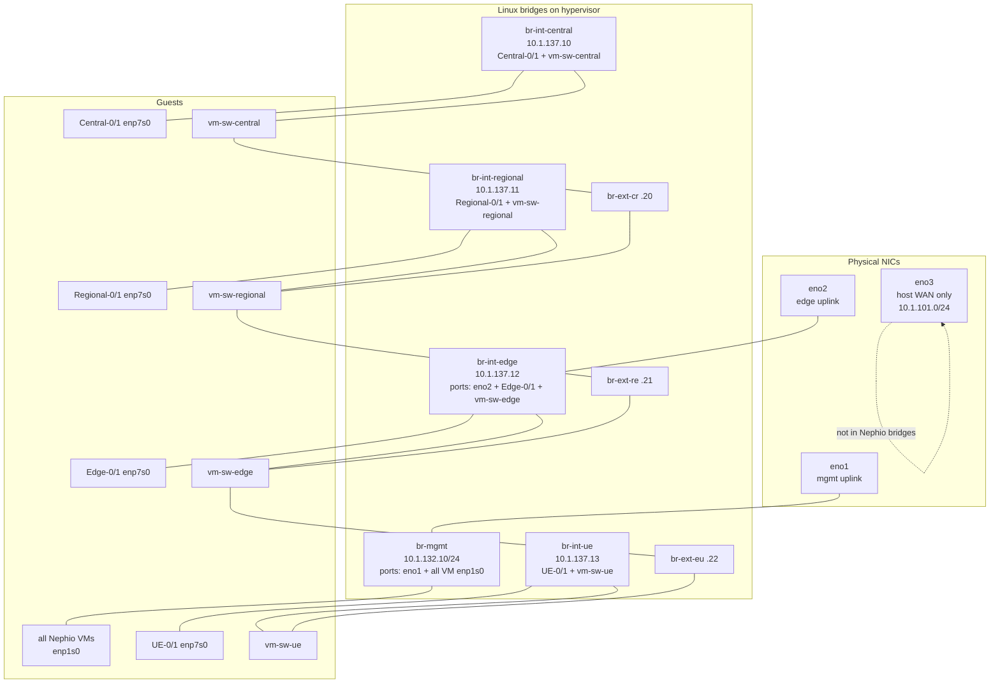
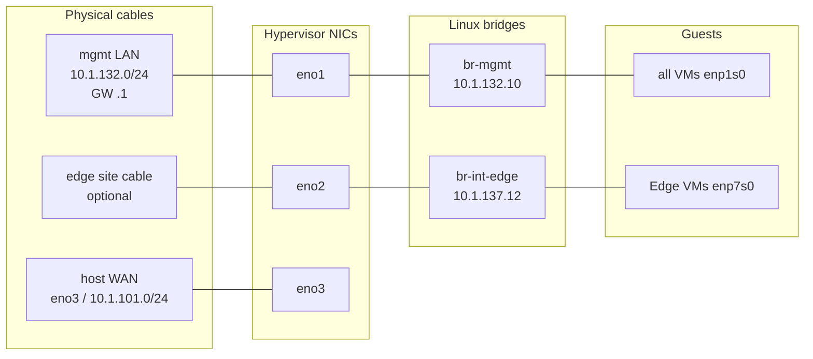

# Current topology

Live lab layout on the hypervisor (PowerEdge R730 / libvirt). Captured from running VMs and host bridges.

Related detail: [nephio/docs/mgmt.md](../nephio/docs/mgmt.md) · [nephio/docs/ip.md](../nephio/docs/ip.md) · [nephio/docs/testbed.md](../nephio/docs/testbed.md) · [oai.md](oai.md)

## Overview

Five Kubernetes clusters (mgmt + central + regional + edge + ue), each 2 nodes. Workload VMs sit on two L2 planes:

| Plane | Guest NIC | Host bridge | Subnet(s) |
|-------|-----------|-------------|-----------|
| **Mgmt** | `enp1s0` | `br-mgmt` (`eno1` uplink) | `10.1.132.0/24` — SSH, default route, DNS |
| **Site** | `enp7s0` | `br-int-<site>` | `10.1.137.0/24` (K8s) + `10.1.138.0/24` (MetalLB) |

Sites are chained by Alpine **vm-sw** L2 switch VMs over `br-ext-*`. Physical uplinks: **`eno1` → `br-mgmt`**, **`eno2` → `br-int-edge`** (L2 bridge ports, not routed through a VM).

### Physical NICs → bridges → VMs



```text
                    EXTERNAL                              HYPERVISOR                         GUESTS
                    --------                              ----------                         ------

  mgmt LAN .132 ──────── eno1 ──────── br-mgmt ──────────┬── mgmt-0/1      enp1s0
       GW .1 ─────────────┘              │               ├── central-0/1  enp1s0
                                         │               ├── regional-0/1 enp1s0
                                         │               ├── edge-0/1     enp1s0
                                         │               └── ue-0/1       enp1s0

  edge cable ─────────── eno2 ──────── br-int-edge ──────┬── edge-0/1     enp7s0
                                         │               └── vm-sw-edge   inf-internal
                                         │                      │
  (no physical NIC) ─────────────── br-int-central ──────┬── central-0/1  enp7s0
                                         │               └── vm-sw-central
  (no physical NIC) ─────────────── br-int-regional ─────┬── regional-0/1 enp7s0
                                         │               └── vm-sw-regional
  (no physical NIC) ─────────────── br-int-ue ───────────┬── ue-0/1       enp7s0
                                                         └── vm-sw-ue

  host WAN .101 ──────── eno3 ──────── (hypervisor default route only)

  Site chain (L2 via vm-sw, host-only):
    vm-sw-central ── br-ext-cr ── vm-sw-regional ── br-ext-re ── vm-sw-edge ── br-ext-eu ── vm-sw-ue
```

Live bridge ports:

| Bridge | Physical | Libvirt ports (examples) |
|--------|----------|--------------------------|
| `br-mgmt` | **`eno1`** | all 10 Nephio `enp1s0` (`vnet221`…`vnet237`) |
| `br-int-central` | — | Central-0/1 + `vm-sw-central` |
| `br-int-regional` | — | Regional-0/1 + `vm-sw-regional` |
| `br-int-edge` | **`eno2`** | Edge-0/1 + `vm-sw-edge` |
| `br-int-ue` | — | UE-0/1 + `vm-sw-ue` |
| `br-ext-cr` / `re` / `eu` | — | vm-sw peer links only |

## Clusters and node IPs

| Cluster | Role | Host | Libvirt VM | Mgmt `enp1s0` | Site `.137` | Site `.138` | API / dashboard |
|---------|------|------|------------|---------------|-------------|-------------|-----------------|
| mgmt | CP | `mgmt-0` | `Nephio-MGMT-0` | `10.1.132.200` | — | — | API `:6443` · dash `:30443` |
| mgmt | worker | `mgmt-1` | `Nephio-MGMT-1` | `10.1.132.201` | — | — | — |
| central | CP | `central-0` | `Nephio-Central-0` | `10.1.132.210` | `10.1.137.110` | `10.1.138.110` | API `.137:6443` · dash `.132:30443` |
| central | worker | `central-1` | `Nephio-Central-1` | `10.1.132.211` | `10.1.137.111` | `10.1.138.111` | — |
| regional | CP | `regional-0` | `Nephio-Regional-0` | `10.1.132.220` | `10.1.137.120` | `10.1.138.120` | API `.137:6443` · dash `.132:30443` |
| regional | worker | `regional-1` | `Nephio-Regional-1` | `10.1.132.221` | `10.1.137.121` | `10.1.138.121` | — |
| edge | CP | `edge-0` | `Nephio-Edge-0` | `10.1.132.230` | `10.1.137.130` | `10.1.138.130` | API `.137:6443` · dash `.132:30443` |
| edge | worker | `edge-1` | `Nephio-Edge-1` | `10.1.132.231` | `10.1.137.131` | `10.1.138.131` | — |
| ue | CP | `ue-0` | `Nephio-UE-0` | `10.1.132.240` | `10.1.137.140` | `10.1.138.140` | API `.137:6443` · dash `.132:30443` |
| ue | worker | `ue-1` | `Nephio-UE-1` | `10.1.132.241` | `10.1.137.141` | `10.1.138.141` | — |

- Default route: `via 10.1.132.1` · DNS: `10.1.132.200` (Pi-hole on `mgmt-0`)
- SSH aliases: [`utils/ssh_config/config`](../utils/ssh_config/config)
- Netplan: [`scripts/setup_ip.sh`](../scripts/setup_ip.sh)

## External interfaces (physical NICs)

Two physical uplinks leave the hypervisor; the rest of the lab stays on host-internal bridges.

| NIC | Bridge | External role | Live state |
|-----|--------|---------------|------------|
| **`eno1`** | `br-mgmt` | Mgmt LAN `10.1.132.0/24` (gateway `10.1.132.1`) | enslaved to `br-mgmt` |
| **`eno2`** | `br-int-edge` | Optional edge site wire (same L2 as `.137`/`.138` on edge) | enslaved to `br-int-edge` |
| **`eno3`** | — | Host internet / DHCP (`10.1.101.0/24`, default route) | **not** in the Nephio bridges |
| `eno4` | — | unused for this topology | — |

```text
  EXTERNAL                         HOST                              GUEST
  --------                         ----                              -----

  mgmt LAN 10.1.132.0/24  ── eno1 ── br-mgmt ── vnet* ── enp1s0   (SSH, default route, DNS)
       GW 10.1.132.1 ───────┘

  edge wire (optional)    ── eno2 ── br-int-edge ── vnet* ── enp7s0  (Edge K8s / MetalLB)
                                      │
                                 vm-sw-edge ── br-ext-* ── other sites (host-only)

  host WAN 10.1.101.0/24  ── eno3 ── (hypervisor only; VMs do not use this)
```



**How VMs reach the outside world**

1. Guest default route is `via 10.1.132.1` on `enp1s0`.
2. That traffic hits `br-mgmt`, then leaves on **`eno1`** to the external mgmt switch/router.
3. Site traffic (`enp7s0` / `.137`/`.138`) stays on the vm-sw fabric unless a peer is plugged into **`eno2`** (edge L2 only).
4. The hypervisor’s own internet path is **`eno3`** (`default via 10.1.101.1`) — separate from the Nephio VM path.

Central / regional / UE site bridges have **no** physical NIC — they only interconnect through vm-sw + `br-ext-*` on the host.

Scripts: [`scripts/setup_mgmt_bridge.sh`](../scripts/setup_mgmt_bridge.sh) (`eno1` → `br-mgmt`), [`scripts/br-int-edge_2_eno2.sh`](../scripts/br-int-edge_2_eno2.sh) (`eno2` → `br-int-edge`).

## Host bridges

| Bridge | Host IP | Physical uplink | Role |
|--------|---------|-----------------|------|
| `br-mgmt` | `10.1.132.10/24` | **`eno1`** | Mgmt L2 to external LAN |
| `br-int-central` | `10.1.137.10/24` | — | Central site L2 |
| `br-int-regional` | `10.1.137.11/24` | — | Regional site L2 |
| `br-int-edge` | `10.1.137.12/24` | **`eno2`** (optional) | Edge site L2 |
| `br-int-ue` | `10.1.137.13/24` | — | UE site L2 |
| `br-ext-cr` | `10.1.137.20/24` | — | Central ↔ regional |
| `br-ext-re` | `10.1.137.21/24` | — | Regional ↔ edge |
| `br-ext-eu` | `10.1.137.22/24` | — | Edge ↔ UE |

Bringup: [`testbed/`](../testbed/) / [`bringup/00_testbed/`](../bringup/00_testbed/). Mgmt bridge: [`scripts/setup_mgmt_bridge.sh`](../scripts/setup_mgmt_bridge.sh).

## Site fabric (vm-sw)

| VM | Host NICs (libvirt) |
|----|---------------------|
| `vm-sw-central` | `br-int-central`, `br-ext-cr`, libvirt `default` (mgmt) |
| `vm-sw-regional` | `br-int-regional`, `br-ext-cr`, `br-ext-re`, `default` |
| `vm-sw-edge` | `br-int-edge`, `br-ext-re`, `br-ext-eu`, `default` |
| `vm-sw-ue` | `br-int-ue`, `br-ext-eu`, `default` |

Guest ports: `inf-internal` → site `br-int-*`; `inf-upper` / `inf-lower` → `br-ext-*`. Login: `sw` / `sw`.

```text
central ── br-ext-cr ── regional ── br-ext-re ── edge ── br-ext-eu ── ue
```

## Storage

All nodes: root LV `ubuntu-lv` **1024 GiB** on `vda` (~1008 G usable ext4).

Extra **2 TiB** local-path disk on **node-0 only** (ext4 → `/opt/local-path-provisioner`):

| Host | Extra disk (host path) | Guest device |
|------|------------------------|--------------|
| `mgmt-0` | `Nephio-MGMT-0-1.qcow2` | `/dev/vdc` (libvirt target `vdb`) |
| `central-0` | `Nephio-Central-0-1.qcow2` | `/dev/vdb` |
| `regional-0` | `Nephio-Regional-0-1.qcow2` | `/dev/vdb` |
| `edge-0` | `Nephio-Edge-0-1.qcow2` | `/dev/vdb` |
| `ue-0` | `Nephio-UE-0-1.qcow2` | `/dev/vdb` |

Worker nodes (`*-1`) have root only (no second disk).

## Libvirt inventory (running)

| Name | State |
|------|-------|
| `Nephio-MGMT-0`, `Nephio-MGMT-1` | running |
| `Nephio-Central-0`, `Nephio-Central-1` | running |
| `Nephio-Regional-0`, `Nephio-Regional-1` | running |
| `Nephio-Edge-0`, `Nephio-Edge-1` | running |
| `Nephio-UE-0`, `Nephio-UE-1` | running |
| `vm-sw-central`, `vm-sw-regional`, `vm-sw-edge`, `vm-sw-ue` | running |

## Quick verify

```bash
virsh list --all
ip -br addr show br-mgmt br-int-central br-int-regional br-int-edge br-int-ue
virsh domiflist Nephio-Central-0
ssh -F utils/ssh_config/config central-0 'ip -br addr; df -h / /opt/local-path-provisioner'
```
