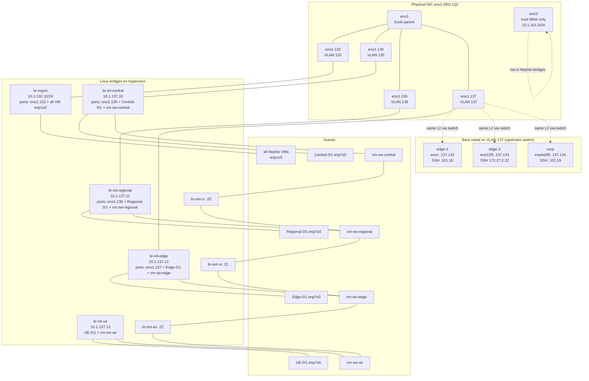
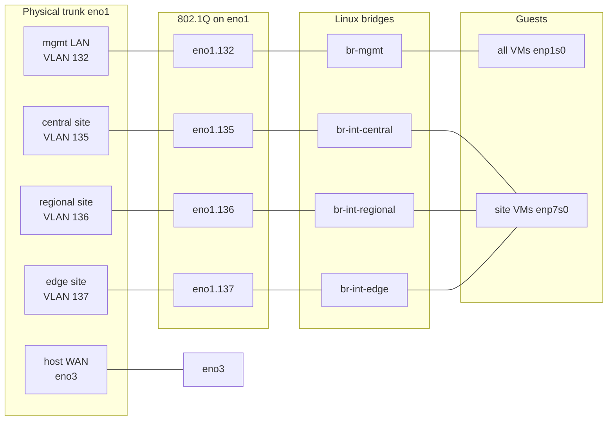

# Current topology

Live lab layout on the hypervisor (PowerEdge R730 / libvirt). Captured from running VMs and host bridges.

Related detail: [nephio/docs/mgmt.md](../nephio/docs/mgmt.md) · [nephio/docs/ip.md](../nephio/docs/ip.md) · [nephio/docs/testbed.md](../nephio/docs/testbed.md) · [oai.md](oai.md)

## Overview

Five Kubernetes clusters (mgmt + central + regional + edge + ue). Workload VMs are 2 nodes each; **edge** also has physical workers `edge-2`, `edge-3`, and `usrp`. Workload VMs sit on two L2 planes:

| Plane | Guest NIC | Host bridge | Subnet(s) |
|-------|-----------|-------------|-----------|
| **Mgmt** | `enp1s0` | `br-mgmt` (`eno1.132` VLAN uplink) | `10.1.132.0/24` — SSH, default route, DNS |
| **Site** | `enp7s0` | `br-int-<site>` | `10.1.137.0/24` (K8s) + `10.1.138.0/24` (MetalLB) |

Sites are chained by Alpine **vm-sw** L2 switch VMs over `br-ext-*`. Physical uplinks on **`eno1`** via **802.1Q VLANs**: **`eno1.132` → `br-mgmt`**, **`eno1.135` → `br-int-central`**, **`eno1.136` → `br-int-regional`**, **`eno1.137` → `br-int-edge`**. **`eno2`** is unused. **`br-int-ue`** stays host-only.

### Physical NICs → bridges → VMs / bare metal



```text
                    EXTERNAL                              HYPERVISOR                         GUESTS / BARE METAL
                    --------                              ----------                         -------------------

  mgmt LAN .132 ──────── eno1.132 ── br-mgmt ──────────┬── mgmt-0/1      enp1s0
       GW .1 ─────────────┘ (VLAN 132)    │               ├── central-0/1  enp1s0
                                         │               ├── regional-0/1 enp1s0
                                         │               ├── edge-0/1     enp1s0
                                         │               └── ue-0/1       enp1s0

  central wire ───────── eno1.135 ── br-int-central ────┬── central-0/1  enp7s0
                                         │               └── vm-sw-central
  regional wire ──────── eno1.136 ── br-int-regional ───┬── regional-0/1 enp7s0
                                         │               └── vm-sw-regional
  edge wire ──────────── eno1.137 ── br-int-edge ───────┬── edge-0/1     enp7s0
       (VLAN 137) ──┬────┘               │               └── vm-sw-edge
                    │
                    ├── edge-2  eno1      .137.132   (SSH 10.1.101.18)
                    ├── edge-3  ens12f0   .137.133   (SSH 172.27.2.22)
                    └── usrp    enp4s0f0  .137.134   (SSH 10.1.101.19)

  (no physical NIC) ─────────────── br-int-ue ───────────┬── ue-0/1       enp7s0
                                                         └── vm-sw-ue

  host WAN .101 ──────── eno3 ──────── (hypervisor default route only;
                                        also SSH path for edge-2 / usrp)

  Site chain (L2 via vm-sw, host-only):
    vm-sw-central ── br-ext-cr ── vm-sw-regional ── br-ext-re ── vm-sw-edge ── br-ext-eu ── vm-sw-ue
```

Live bridge ports:

| Bridge | Physical uplink | Libvirt ports (examples) | VLAN peers (not on hypervisor) |
|--------|-----------------|--------------------------|--------------------------------|
| `br-mgmt` | **`eno1.132`** (VLAN 132) | all 10 Nephio `enp1s0` (`vnet221`…`vnet237`) | — |
| `br-int-central` | **`eno1.135`** (VLAN 135) | Central-0/1 + `vm-sw-central` | — |
| `br-int-regional` | **`eno1.136`** (VLAN 136) | Regional-0/1 + `vm-sw-regional` | — |
| `br-int-edge` | **`eno1.137`** (VLAN 137) | Edge-0/1 + `vm-sw-edge` | **`edge-2`**, **`edge-3`**, **`usrp`** (site `.137`) |
| `br-int-ue` | — | UE-0/1 + `vm-sw-ue` | — |
| `br-ext-cr` / `re` / `eu` | — | vm-sw peer links only | — |

## Clusters and node IPs

| Cluster | Role | Host | Libvirt VM | Mgmt `enp1s0` | Site `.137` | Site `.138` | API / dashboard |
|---------|------|------|------------|---------------|-------------|-------------|-----------------|
| mgmt | CP | `mgmt-0` | `Nephio-MGMT-0` | `10.1.132.200` | — | — | API `:6443` · dash `:30443` |
| mgmt | worker | `mgmt-1` | `Nephio-MGMT-1` | `10.1.132.201` | — | — | — |
| central | CP | `central-0` | `Nephio-Central-0` | `10.1.132.210` | `10.1.137.110` | `10.1.138.110` | API `.137:6443` · dash `.132:30443` |
| central | worker | `central-1` | `Nephio-Central-1` | `10.1.132.211` | `10.1.137.111` | `10.1.138.111` | — |
| regional | CP | `regional-0` | `Nephio-Regional-0` | `10.1.132.220` | `10.1.137.120` | `10.1.138.120` | API `.137:6443` · dash `.132:30443` |
| regional | worker | `regional-1` | `Nephio-Regional-1` | `10.1.132.221` | `10.1.137.121` | `10.1.138.121` | — |
| edge | CP | `edge-0` | `Nephio-Edge-0` | `10.1.132.230` | `10.1.137.130` | `10.1.138.130` | API `.137:6443` · dash `.132:30443` |
| edge | worker | `edge-1` | `Nephio-Edge-1` | `10.1.132.231` | `10.1.137.131` | `10.1.138.131` | — |
| ue | CP | `ue-0` | `Nephio-UE-0` | `10.1.132.240` | `10.1.137.140` | `10.1.138.140` | API `.137:6443` · dash `.132:30443` |
| ue | worker | `ue-1` | `Nephio-UE-1` | `10.1.132.241` | `10.1.137.141` | `10.1.138.141` | — |

### Physical edge workers (bare metal)

Extra edge-cluster workers on VLAN 137 (same L2 as `br-int-edge`). Site netplan only under [`workloads/netplan/<host>/55-k8s.yaml`](../workloads/netplan/); bootstrap with [`workloads/wl_setup_ssh_mgmt_ip.sh`](../workloads/wl_setup_ssh_mgmt_ip.sh). SSH is via a separate NIC (not `10.1.132.0/24`).

| Host | Role | SSH | Site / K8s NIC | Site `.137` | Netplan |
|------|------|-----|----------------|-------------|---------|
| `edge-2` | worker | `10.1.101.18` | `eno1` | `10.1.137.132` | [`edge-2/55-k8s.yaml`](../workloads/netplan/edge-2/55-k8s.yaml) |
| `edge-3` | worker | `172.27.2.22` | `ens12f0` | `10.1.137.133` | [`edge-3/55-k8s.yaml`](../workloads/netplan/edge-3/55-k8s.yaml) |
| `usrp` | worker (OAI CU-CP/DU/UEs) | `10.1.101.19` | `enp4s0f0` | `10.1.137.134` | [`usrp/55-k8s.yaml`](../workloads/netplan/usrp/55-k8s.yaml) |

Do not confuse **`usrp` `10.1.137.134`** with hypervisor bridge **`br-int-ue` `10.1.137.13`**.

- Default route (VMs): `via 10.1.132.1` · DNS: `10.1.132.200` (Pi-hole on `mgmt-0`)
- SSH aliases: [`utils/ssh_config/config`](../utils/ssh_config/config)
- VM netplan: [`scripts/setup_ip.sh`](../scripts/setup_ip.sh)

## External interfaces (physical NICs)

One trunk NIC (**`eno1`**) carries four VLAN uplinks; **`eno2`** is unused. Host WAN stays on **`eno3`**.

| NIC / VLAN | Bridge | External role | VLAN ID |
|------------|--------|---------------|---------|
| **`eno1.132`** | `br-mgmt` | Mgmt LAN `10.1.132.0/24` (gateway `10.1.132.1`) | 132 |
| **`eno1.135`** | `br-int-central` | Central site L2 (`.137`/`.138`) | 135 |
| **`eno1.136`** | `br-int-regional` | Regional site L2 | 136 |
| **`eno1.137`** | `br-int-edge` | Edge site L2 | 137 |
| **`eno1`** | — | Trunk parent (no IP, not a bridge port) | — |
| **`eno2`** | — | Unused | — |
| **`eno3`** | — | Host internet / DHCP (`10.1.101.0/24`, default route) | — |

```text
  EXTERNAL                         HOST                              GUEST
  --------                         ----                              -----

  mgmt LAN 10.1.132.0/24  ── eno1.132 ── br-mgmt ── vnet* ── enp1s0   (SSH, default route, DNS)
       GW 10.1.132.1 ───────┘

  central wire (VLAN 135) ── eno1.135 ── br-int-central ── vnet* ── enp7s0
  regional wire (VLAN 136) ─ eno1.136 ── br-int-regional ── vnet* ── enp7s0
  edge wire (VLAN 137)     ── eno1.137 ── br-int-edge ── vnet* ── enp7s0

  host WAN 10.1.101.0/24  ── eno3 ── (hypervisor only; VMs do not use this)
```



**How VMs reach the outside world**

1. Guest default route is `via 10.1.132.1` on `enp1s0`.
2. That traffic hits `br-mgmt`, then leaves on **`eno1.132`** (VLAN 132) to the external mgmt switch/router.
3. Site traffic (`enp7s0` / `.137`/`.138`) exits each site bridge on the matching **`eno1.{135,136,137}`** VLAN when wired externally.
4. The hypervisor’s own internet path is **`eno3`** (`default via 10.1.101.1`) — separate from the Nephio VM path.

**`br-int-ue`** has no physical VLAN uplink — UE site traffic stays on the vm-sw fabric unless routed elsewhere.

Scripts: [`scripts/setup_eno1_vlan_uplinks.sh`](../scripts/setup_eno1_vlan_uplinks.sh) (VLAN uplinks), [`scripts/setup_mgmt_bridge.sh`](../scripts/setup_mgmt_bridge.sh) (`eno1.132` → `br-mgmt` + VM mgmt NICs). Legacy **`eno2`** script: [`scripts/br-int-edge_2_eno2.sh`](../scripts/br-int-edge_2_eno2.sh) (deprecated).

## Host bridges

| Bridge | Host IP | Physical uplink | Role |
|--------|---------|-----------------|------|
| `br-mgmt` | `10.1.132.10/24` | **`eno1.132`** | Mgmt L2 to external LAN |
| `br-int-central` | `10.1.137.10/24` | **`eno1.135`** | Central site L2 |
| `br-int-regional` | `10.1.137.11/24` | **`eno1.136`** | Regional site L2 |
| `br-int-edge` | `10.1.137.12/24` | **`eno1.137`** | Edge site L2 |
| `br-int-ue` | `10.1.137.13/24` | — | UE site L2 (host-only) |
| `br-ext-cr` | `10.1.137.20/24` | — | Central ↔ regional |
| `br-ext-re` | `10.1.137.21/24` | — | Regional ↔ edge |
| `br-ext-eu` | `10.1.137.22/24` | — | Edge ↔ UE |

Bringup: [`bringup/00_testbed/readme.md`](../bringup/00_testbed/readme.md) · [`bringup/00_testbed/bringup_switches.sh`](../bringup/00_testbed/bringup_switches.sh). Mgmt: [`scripts/setup_mgmt_bridge.sh`](../scripts/setup_mgmt_bridge.sh).

## Site fabric (vm-sw)

| VM | Host NICs (libvirt) |
|----|---------------------|
| `vm-sw-central` | `br-int-central`, `br-ext-cr`, libvirt `default` (mgmt) |
| `vm-sw-regional` | `br-int-regional`, `br-ext-cr`, `br-ext-re`, `default` |
| `vm-sw-edge` | `br-int-edge`, `br-ext-re`, `br-ext-eu`, `default` |
| `vm-sw-ue` | `br-int-ue`, `br-ext-eu`, `default` |

Guest ports: `inf-internal` → site `br-int-*`; `inf-upper` / `inf-lower` → `br-ext-*`. Login: `sw` / `sw`.

```text
central ── br-ext-cr ── regional ── br-ext-re ── edge ── br-ext-eu ── ue
                 ↑ 10ms              ↑ 10ms              (no netem)
           central inf-lower    regional inf-lower
                                              │
                                         eno1.137 (VLAN 137, edge L2)
```

### Latency matrix (site plane `.137`)

Netem on **`inf-lower` only** (`vm-sw-central`, `vm-sw-regional`): configured **10 ms each way** → **~20 ms RTT** per hop. Edge↔UE has **no** netem. Details: [nephio/docs/testbed.md](../nephio/docs/testbed.md#interconnect-latency-netem).

**External peer on VLAN 137** = host on the upstream switch in VLAN **137** → same L2 as edge site (`.137`/`.138`). Use VLAN **132** for mgmt/SSH (`.132`).

**Designed RTT (ms)**

|  | central | regional | edge | ue | VLAN 137 peer |
|--|---------|----------|------|-----|------|
| **central** | — | ~20 | ~40 | ~40 | ~40 |
| **regional** | ~20 | — | ~20 | ~20 | ~20 |
| **edge** | ~40 | ~20 | — | ~0 | ~0 |
| **ue** | ~40 | ~20 | ~0 | — | ~0 |
| **VLAN 137 peer** | ~40 | ~20 | ~0 | ~0 | — |

**Measured** (ping avg, `*-0` → `10.1.137.x`, 2026-07-28; VLAN 137 peer ≈ edge by L2):

|  | central | regional | edge | ue | VLAN 137 peer |
|--|---------|----------|------|-----|------|
| **central** | — | 28 ms | 55 ms | 55 ms | ≈edge (~55 ms) |
| **regional** | 21 ms | — | 29 ms | 29 ms | ≈edge (~29 ms) |
| **edge** | 41 ms | 21 ms | — | 0.8 ms | ~0 ms |
| **ue** | 42 ms | 21 ms | 0.9 ms | — | ~0 ms |
| **VLAN 137 peer** | ≈edge | ≈edge | ~0 ms | ~0 ms | — |

Mgmt plane (`.132` / VLAN **132** / `br-mgmt`): **~0.6 ms** between Nephio sites (no netem).

## Storage

All nodes: root LV `ubuntu-lv` **1024 GiB** on `vda` (~1008 G usable ext4).

Extra **2 TiB** local-path disk on **node-0 only** (ext4 → `/opt/local-path-provisioner`):

| Host | Extra disk (host path) | Guest device |
|------|------------------------|--------------|
| `mgmt-0` | `Nephio-MGMT-0-1.qcow2` | `/dev/vdc` (libvirt target `vdb`) |
| `central-0` | `Nephio-Central-0-1.qcow2` | `/dev/vdb` |
| `regional-0` | `Nephio-Regional-0-1.qcow2` | `/dev/vdb` |
| `edge-0` | `Nephio-Edge-0-1.qcow2` | `/dev/vdb` |
| `ue-0` | `Nephio-UE-0-1.qcow2` | `/dev/vdb` |

Worker nodes (`*-1`) have root only (no second disk).

## Libvirt inventory (running)

| Name | State |
|------|-------|
| `Nephio-MGMT-0`, `Nephio-MGMT-1` | running |
| `Nephio-Central-0`, `Nephio-Central-1` | running |
| `Nephio-Regional-0`, `Nephio-Regional-1` | running |
| `Nephio-Edge-0`, `Nephio-Edge-1` | running |
| `Nephio-UE-0`, `Nephio-UE-1` | running |
| `vm-sw-central`, `vm-sw-regional`, `vm-sw-edge`, `vm-sw-ue` | running |

## Quick verify

```bash
virsh list --all
ip -d link show type vlan
bridge link | grep eno1\.
ip -br addr show br-mgmt br-int-central br-int-regional br-int-edge br-int-ue
virsh domiflist Nephio-Central-0
ssh -F utils/ssh_config/config central-0 'ip -br addr; df -h / /opt/local-path-provisioner'
```
