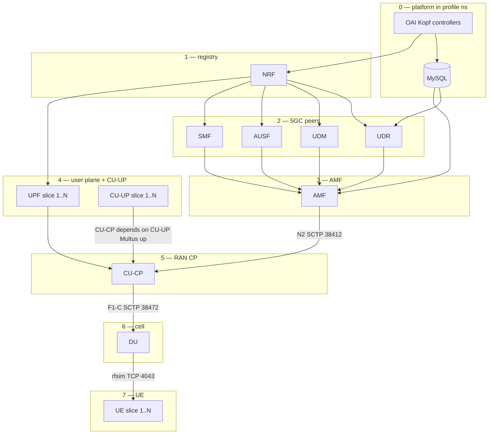

# Profile bring-up dependency order

Target order for a dedicated-core profile (`ina-infra*`). Arrows mean
**“B waits until A is ready”** (`A → B`).

## Layers

| Layer | Components | Gate |
|---|---|---|
| 0 | Kopf controllers + MySQL | controllers Running; MySQL `:3306` |
| 1 | NRF | Deployment Ready + NFM HTTP |
| 2 | UDR, UDM, AUSF, SMF | init → NRF (UDR also → MySQL) |
| 3 | AMF | init → MySQL + NRF + UDR + UDM + AUSF + SMF |
| 4 | UPF + CU-UP per slice | UPF init → NRF; CU-UP Multus E1/F1-U/N3 up |
| 5 | CU-CP | init → **all CU-UP** (Multus up) + AMF N2 + UPF@NRF |
| 6 | DU | init → CU-CP F1-C (SCTP `:38472`) |
| 7 | UE per slice | init → DU rfsim (TCP `:4043`) |

UPF + CU-UP co-location (lab default): slice **1 → central**, **2 → regional**,
**3–N → edge**. CU-CP / DU / UEs on **edge** (`usrp` for DU/UE).

## Graph

## CU-CP ↔ CU-UP

**Bring-up dependency:** CU-CP **depends on CU-UP** — do not start CU-CP until
every slice CU-UP Multus address is reachable (E1 IP ping).

**E1 protocol role (separate):** once CU-CP is up, **CU-CP listens** on
`:38462` and **CU-UP dials** it (retries until CU-CP appears). So:

| Concern | Direction |
|---|---|
| Start order | CU-UP ready → then CU-CP |
| E1 SCTP | CU-CP server ← CU-UP client |

Do **not** probe CU-UP for an E1 *listener* (`sctp://cuup_e1:38462`) — that
port is closed on CU-UP and deadlocks init. Use Multus reachability (ping)
instead.

## Protocol roles

| Link | Listener (server) | Dialer (client) |
|---|---|---|
| NGAP N2 | AMF `:38412` | CU-CP |
| E1 | **CU-CP** `:38462` | **CU-UP** |
| F1-C | CU-CP `:38472` | DU |
| rfsim | DU `:4043` | UE |
| PFCP N4 | UPF | SMF |

## Containers in RAN pods (`ran_workloads.py`)

Each RAN pod gets:

1. **`bringup-*` initContainers** (sequential) — gate the main NF  
2. **`bringup-order` sidecar** — prints this pod’s dependency chain, then
   `sleep infinity` (`kubectl logs <pod> -c bringup-order`)  
3. Main NF + optional `debug` sidecar  

| Workload | `bringup-*` inits (order) | Sidecar role |
|---|---|---|
| CU-UP | *(none — starts before CU-CP)* | `cu-up-N` |
| CU-CP | `bringup-cuup` → `bringup-amf` → `bringup-upf` | `cu-cp` |
| DU | `bringup-cucp` | `du` |
| UE | `bringup-du` | `ue-N` |

Core NFs (AMF/…/UPF) still use controller utils inits (`wait-5gc`, NRF, …).

Optional staged script: `backend/scripts/profile_rollout.sh`
— NRF → UPF@NRF → SMF(+PFCP) → CU-CP → UEs.
