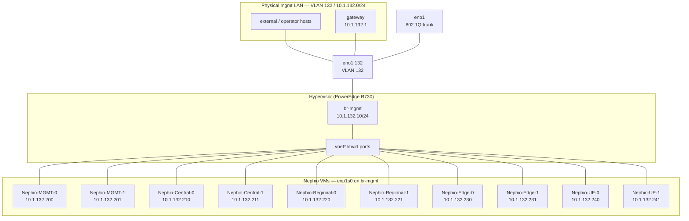

# Management network topology

Operator and cluster **mgmt** traffic uses **`10.1.132.0/24`** on guest **`enp1s0`**. Workload VMs reach that L2 via host bridge **`br-mgmt`**, with physical uplink **`eno1.132`** (VLAN **132** on trunk **`eno1`**).

Site / Kubernetes traffic stays on **`br-int-*`** via a second virtio NIC (`enp7s0`), each site bridge with its own VLAN uplink (**135** central, **136** regional, **137** edge). See [ip.md](ip.md), [bringup/00_testbed/readme.md](../../bringup/00_testbed/readme.md), and [docs/topology.md](../../docs/topology.md).

## Host topology

**Subnet:** `10.1.132.0/24` on `br-mgmt` (guest `enp1s0`). Default route `via 10.1.132.1`; DNS `10.1.132.200` (Pi-hole on `mgmt-0`).



**Mgmt MetalLB VIPs** on the same L2 (`10.1.132.10`–`.99` pool): registry `.30`, OpenSpeedTest `.11`, Gitea `.200`, Nephio Web UI `.52`. See [ip.md](ip.md).

Each workload VM has **two** libvirt NICs:

| Guest NIC | Libvirt type | Host attachment | Addresses (example: central-0) |
|-----------|--------------|-----------------|----------------------------------|
| `enp1s0` | bridge | `br-mgmt` | `10.1.132.210/24` — SSH, default route, DNS, dashboard `:30443` |
| `enp7s0` | bridge | `br-int-<site>` | `10.1.137.110/24` + `10.1.138.110/24` — K8s API `:6443`, Flannel, MetalLB |

Inside the guest, mgmt is configured by [`utils/netplan/*/55-nephio-mgmt.yaml`](../../utils/netplan/central-0/55-nephio-mgmt.yaml) (`enp1s0`, default `via 10.1.132.1`, DNS `10.1.132.200`). Deploy with [`scripts/setup_ip.sh`](../../scripts/setup_ip.sh).

## VLAN uplink on `eno1.132`

Physical **`eno1`** is a **trunk** (no IP, not a bridge port). **`eno1.132`** (802.1Q VLAN **132**) is the **bridge port** on **`br-mgmt`**. VM mgmt NICs use libvirt **`bridge`** → `br-mgmt`, not **`direct`** → `eno1`.

**Requirement:** `eno1` must have **no macvtap/macvlan children**. VLAN subinterfaces are created by [`scripts/setup_eno1_vlan_uplinks.sh`](../../scripts/setup_eno1_vlan_uplinks.sh) (also run from [`bringup/00_testbed/bringup_switches.sh`](../../bringup/00_testbed/bringup_switches.sh) step 1b).

| Host object | Role |
|-------------|------|
| `eno1` | Trunk parent (802.1Q; VLANs 132/135/136/137) |
| `eno1.132` | Mgmt uplink — L2 bridge port on `br-mgmt` (no IP) |
| `br-mgmt` | Linux bridge; host IP `10.1.132.10/24` + libvirt VM ports |
| `vnet*` | Per-VM virtio port on `br-mgmt` |

STP is **off** on `br-mgmt` (same as testbed `br-int-*` bridges).

## Bring up mgmt + VLAN uplinks

```bash
cd bringup/00_testbed

# Site bridges + VLAN uplinks (includes eno1.132 -> br-mgmt)
sudo ./bringup_switches.sh up --uplinks
# or full testbed:
sudo ./bringup_switches.sh up

cd ../../scripts

# Attach all VM enp1s0 to br-mgmt
sudo ./setup_mgmt_bridge.sh setup

# Host bridge only (no libvirt attach)
sudo ./setup_mgmt_bridge.sh setup --no-vms

# Also push guest netplan (needs SSH to VMs)
sudo ./setup_mgmt_bridge.sh setup --apply-netplan

sudo ./setup_mgmt_bridge.sh status
sudo ./setup_mgmt_bridge.sh verify
sudo ./setup_mgmt_bridge.sh down
```

Default host IP on `br-mgmt`: **`10.1.132.10/24`**. Route **`10.1.132.0/24`** uses `br-mgmt`. Verify pings **`10.1.132.200`** (mgmt-0) and **`10.1.132.1`** (gateway).

## Attach VM mgmt NIC to `br-mgmt`

```bash
virsh attach-interface Nephio-Central-0 \
  --type bridge \
  --source br-mgmt \
  --model virtio \
  --mac 52:54:00:b0:84:4c \
  --config \
  --live
```

Repeat per VM (stable MACs in `setup_mgmt_bridge.sh`). Site NICs: [`bringup/00_testbed/attach_vm.sh`](../../bringup/00_testbed/attach_vm.sh).

## Node addresses (mgmt / `enp1s0`)

| Cluster | Host | Mgmt IP (`enp1s0`) | Site `.137` (`enp7s0`) | Site `.138` (`enp7s0`) | Dashboard `:30443` |
|---------|------|--------------------|-------------------------|-------------------------|---------------------|
| mgmt | `mgmt-0` | `10.1.132.200` | — | — | `https://10.1.132.200:30443` |
| mgmt | `mgmt-1` | `10.1.132.201` | — | — | — |
| central | `central-0` | `10.1.132.210` | `10.1.137.110` | `10.1.138.110` | `https://10.1.132.210:30443` |
| central | `central-1` | `10.1.132.211` | `10.1.137.111` | `10.1.138.111` | — |
| regional | `regional-0` | `10.1.132.220` | `10.1.137.120` | `10.1.138.120` | `https://10.1.132.220:30443` |
| regional | `regional-1` | `10.1.132.221` | `10.1.137.121` | `10.1.138.121` | — |
| edge | `edge-0` | `10.1.132.230` | `10.1.137.130` | `10.1.138.130` | `https://10.1.132.230:30443` |
| edge | `edge-1` | `10.1.132.231` | `10.1.137.131` | `10.1.138.131` | — |
| ue | `ue-0` | `10.1.132.240` | `10.1.137.140` | `10.1.138.140` | `https://10.1.132.240:30443` |
| ue | `ue-1` | `10.1.132.241` | `10.1.137.141` | `10.1.138.141` | — |

K8s API (`:6443`) uses the **`.137`** address on control-plane nodes. Default route on all nodes: **`via 10.1.132.1`**. DNS: **`10.1.132.200`** (Pi-hole on `mgmt-0`).

Full VIP and pool tables: [ip.md](ip.md). SSH aliases: [`utils/ssh_config/config`](../../utils/ssh_config/config).

## Verify

On the host:

```bash
sudo ./scripts/setup_mgmt_bridge.sh status
ip -d link show type vlan
bridge link | grep eno1\.
ip -br link show br-mgmt eno1.132

virsh domiflist Nephio-Central-0
```

From a VM (guest `enp1s0`):

```bash
ip -br addr show enp1s0
ping -c2 10.1.132.1
ping -c2 10.1.132.200
```

## Relation to site testbed

Each Nephio VM sits on **two planes**: mgmt (`enp1s0` on `br-mgmt` via VLAN 132) and site (`enp7s0` on `br-int-<site>` via VLAN 135/136/137 or internal UE fabric).

```text
  EXTERNAL                         HOST                              GUEST VM
  --------                         ----                              --------

  mgmt LAN (.132) VLAN 132  ── eno1.132 ── br-mgmt ── vnet* ── enp1s0  (all clusters)
  central site VLAN 135     ── eno1.135 ── br-int-central ── enp7s0
  regional site VLAN 136    ── eno1.136 ── br-int-regional ── enp7s0
  edge site VLAN 137        ── eno1.137 ── br-int-edge ── enp7s0
  ue site (internal)        ── (no VLAN) ── br-int-ue ── enp7s0
                                    │
                               vm-sw-* ── br-ext-* ── inter-site L2 + netem
```

### Layer map

| Plane | Host bridge | VLAN / uplink | Guest NIC | Subnets |
|-------|-------------|---------------|-----------|---------|
| **Mgmt** | `br-mgmt` | **`eno1.132`** (132) | `enp1s0` (all VMs) | `10.1.132.0/24` |
| **Site (central)** | `br-int-central` | **`eno1.135`** (135) | `enp7s0` | `.137`, `.138`, `.139` macvlan |
| **Site (regional)** | `br-int-regional` | **`eno1.136`** (136) | `enp7s0` | `.137`, `.138`, `.139` |
| **Site (edge)** | `br-int-edge` | **`eno1.137`** (137) | `enp7s0` | `.137`, `.138`, `.139` |
| **Site (ue)** | `br-int-ue` | none (host-only) | `enp7s0` | `.137`, `.138`, `.139` |

Site interconnect (`br-int-*` → `vm-sw-*` → `br-ext-*`): [testbed.md](testbed.md).

## Persistence

VLAN and bridge setup is runtime-only. After reboot:

```bash
sudo ./bringup/00_testbed/bringup_switches.sh up
sudo ./scripts/setup_mgmt_bridge.sh setup
sudo ./bringup/00_testbed/attach_vm.sh attach
```

Libvirt `--config` attachments survive reboot once bridges and VLANs exist.

## Related scripts

| Script | Purpose |
|--------|---------|
| [bringup/00_testbed/bringup_switches.sh](../../bringup/00_testbed/bringup_switches.sh) | Bridges + VLAN uplinks + vm-sw |
| [scripts/setup_eno1_vlan_uplinks.sh](../../scripts/setup_eno1_vlan_uplinks.sh) | `eno1.{132,135,136,137}` create/attach |
| [scripts/setup_mgmt_bridge.sh](../../scripts/setup_mgmt_bridge.sh) | `br-mgmt` + VM `enp1s0` |
| [scripts/setup_ip.sh](../../scripts/setup_ip.sh) | Push mgmt + site netplan to guests |
| [scripts/bringup_cluster.sh](../../scripts/bringup_cluster.sh) | Kubernetes bootstrap (mgmt on `enp1s0`) |
| [bringup/00_testbed/attach_vm.sh](../../bringup/00_testbed/attach_vm.sh) | Attach site NIC to `br-int-*` |

Legacy (deprecated): [scripts/br-int-edge_2_eno2.sh](../../scripts/br-int-edge_2_eno2.sh) — direct `eno2` uplink replaced by **`eno1.137`**.
