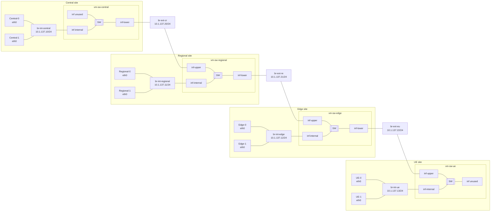

# Testbed network topology

Each site is laid out top to bottom: **VMs → internal bridge → site switch (vm-sw)**.

**Subnet:** all bridges use `10.1.137.0/24`. Step 1 assigns a bridge IP on each `br-*`:

| Bridge | IP |
|--------|-----|
| `br-int-central` | `10.1.137.10/24` |
| `br-int-regional` | `10.1.137.11/24` |
| `br-int-edge` | `10.1.137.12/24` |
| `br-int-ue` | `10.1.137.13/24` |
| `br-ext-cr` | `10.1.137.20/24` |
| `br-ext-re` | `10.1.137.21/24` |
| `br-ext-eu` | `10.1.137.22/24` |

`10.1.137.23` is reserved.

**Staged bringup:**

| Step | Command | What happens |
|------|---------|--------------|
| 1 | `bringup_switches.sh up --bridges` | Create host `br-int-*` / `br-ext-*` + IPs |
| 2 | `bringup_switches.sh up --vms` | Start libvirt `vm-sw-*` VMs on those bridges |

**Step 2:** each `vm-sw-*` VM is a pure L2 switch (Alpine guest). Libvirt attaches virtio NICs as `eth0`/`eth1`/…; cloud-init renames them to `inf-internal` / `inf-upper` / `inf-lower` and bridges them on `br0`.

| Endpoint | Interface | Connects to |
|----------|-----------|-------------|
| Workload VM (e.g. Central-0) | guest `eth0` | site bridge via libvirt |
| Site switch VM (`vm-sw-*`) | `inf-internal` / `inf-upper` / `inf-lower` | host `br-int-*` / `br-ext-*` |
| Host bridge `br-*` | tap/vnet port | created when vm-sw starts |

| Guest port | Role | Host bridge |
|------------|------|-------------|
| `inf-internal` | internal (top) | `br-int-<site>` |
| `inf-upper` | upper tier | `br-ext-cr` / `br-ext-re` / `br-ext-eu` |
| `inf-lower` | lower tier | `br-ext-cr` / `br-ext-re` / `br-ext-eu` |
| `inf-mgmt` | management (routed) | libvirt `default` NAT (`virbr0`) |

Central: `inf-internal` + `inf-lower` (`br-ext-cr`). UE: `inf-internal` + `inf-upper` (`br-ext-eu`).

Each vm-sw also has **`inf-mgmt`** on libvirt’s **`default`** network (Virt-Manager: “Virtual network 'default' : NAT”, host `virbr0`, typically `192.168.122.0/24`). `inf-mgmt` is **not** bridged to site `br0` — use it for SSH/ping/internet from the host.



## Bring up bridges and vm-sw

```bash
cd testbed

# Step 1 — host bridges + 10.1.137.x
sudo ./bringup_switches.sh up --bridges

# Step 2 — libvirt vm-sw site switches
sudo ./bringup_switches.sh up --vms

# Or both steps:
sudo ./bringup_switches.sh up

sudo ./bringup_switches.sh status
sudo ./bringup_switches.sh down
sudo ./bringup_switches.sh down --wipe   # delete vm-sw disks; next up re-runs cloud-init
```

**Requirements for step 2:** `virsh`, `virt-install`, `qemu-img`, `cloud-localds` (packages: `libvirt-clients`, `virtinst`, `qemu-utils`, `cloud-image-utils`). Libvirt **`default`** NAT network must exist and be active (`virsh net-list --all`).

## Switch management (`inf-mgmt` / libvirt `default`)

Step 2 attaches an extra virtio NIC per vm-sw to libvirt’s **`default`** network (same as Virt-Manager “Virtual network 'default' : NAT”). The guest renames it to `inf-mgmt`, runs DHCP, and starts `sshd`.

From the host:

```bash
virsh net-dhcp-leases default
# or: virsh domifaddr vm-sw-central

ssh sw@192.168.122.x   # password: sw
ping -c 2 192.168.122.x
```

From console (`sudo virsh console vm-sw-central`, login `sw` / `sw`):

```bash
ip -br addr show inf-mgmt
ping -c 2 1.1.1.1
```

Recreate vm-sw after changing mgmt NIC wiring: `sudo ./bringup_switches.sh down --wipe && sudo ./bringup_switches.sh up`

## Host interface names

After step 2:

```bash
bridge link show dev br-int-central
virsh domiflist vm-sw-central
# inside guest (virsh console): ip -br link  → inf-internal, inf-lower, inf-mgmt, br0
```

| Host bridge | Bridge IP | vm-sw | Guest port |
|-------------|-----------|-------|------------|
| `br-int-central` | `10.1.137.10/24` | `vm-sw-central` | `inf-internal` |
| `br-int-regional` | `10.1.137.11/24` | `vm-sw-regional` | `inf-internal` |
| `br-int-edge` | `10.1.137.12/24` | `vm-sw-edge` | `inf-internal` |
| `br-int-ue` | `10.1.137.13/24` | `vm-sw-ue` | `inf-internal` |
| `br-ext-cr` | `10.1.137.20/24` | central + regional | `inf-lower` / `inf-upper` |
| `br-ext-re` | `10.1.137.21/24` | regional + edge | `inf-lower` / `inf-upper` |
| `br-ext-eu` | `10.1.137.22/24` | edge + UE | `inf-lower` / `inf-upper` |

| Workload VM | Guest NIC | Attach to |
|-------------|-----------|-----------|
| Central-0 / Central-1 | `eth0` | `br-int-central` |
| Regional-0 / Regional-1 | `eth0` | `br-int-regional` |
| Edge-0 / Edge-1 | `eth0` | `br-int-edge` |
| UE-0 / UE-1 | `eth0` | `br-int-ue` |

vm-sw scripts and guest bridge setup: [`vm-sw/`](vm-sw/).

VM disk images are stored under `/var/lib/libvirt/images/vm-sw` (override with `VM_SW_IMAGE_DIR`). Local `testbed/vm-sw/images/` is gitignored.

Guest login: user **`sw`**, password **`sw`**. Cloud-init (package install) runs only when a per-VM qcow2 is **created or rebuilt**. Each disk has a `.build` fingerprint (base image, `guest-bridge.sh`, cloud-init recipe, NIC layout); `up` auto-rebuilds stale overlays when inputs change (like Docker). `down` keeps disks; `down --wipe` deletes them.

## Host: disable ping between bridges

All `10.1.137.x` IPs are on this host. To stop the host stack from answering or sending ICMP on the testbed bridges (vm-sw L2 still up):

```bash
# disable
sudo iptables -I INPUT  -d 10.1.137.0/24 -p icmp -j DROP
sudo iptables -I OUTPUT -d 10.1.137.0/24 -p icmp -j DROP

# re-enable
sudo iptables -D INPUT  -d 10.1.137.0/24 -p icmp -j DROP
sudo iptables -D OUTPUT -d 10.1.137.0/24 -p icmp -j DROP
```

Only between two bridges (example: central → regional):

```bash
sudo iptables -I OUTPUT -o br-int-central -d 10.1.137.11 -p icmp -j DROP
sudo iptables -I INPUT  -i br-int-regional -s 10.1.137.10 -p icmp -j DROP
```
