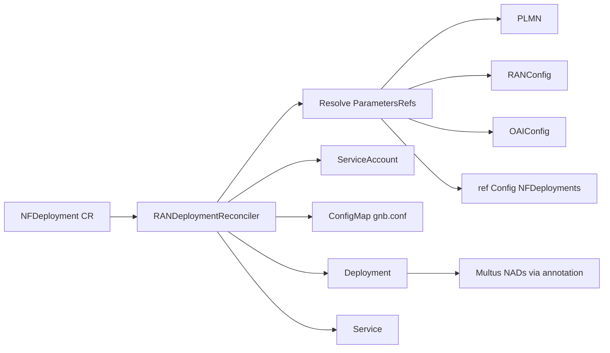

# Architecture

One controller process watches `workload.nephio.org/v1alpha1` **`NFDeployment`** objects and materializes OAI RAN pods from them. Provider string selects CU-CP / CU-UP / DU.

## Supported providers

| Provider | NF | Typical site (lab) |
|----------|----|--------------------|
| `cucp.openairinterface.org` | CU-CP | regional / edge |
| `cuup.openairinterface.org` | CU-UP | co-located with UPF |
| `du.openairinterface.org` | DU (+ rfsim flags) | edge / `usrp` |

Defined in `GetSupportedProviders()` (`internal/controller/randeployment_controller.go`). Other providers set status `invalidProvider` and exit.

## Reconcile behavior

1. Load `NFDeployment`; reject unsupported `spec.provider`.
2. Resolve `spec.parametersRefs` into `ConfigInfo` (see [api.md](api.md)). Mandatory self-config kinds: **`PLMN`**, **`RANConfig`**, **`OAIConfig`**.
3. On first create (finalizer absent): call `CreateAll` for the matching resource builder (`CuCpResources` / `CuUpResources` / `DuResources`) — ServiceAccount, ConfigMap(s), Deployment, Service(s). Add finalizer `batch.tutorial.kubebuilder.io/finalizer`.
4. On delete: `DeleteAll` for the same resources, then remove finalizer.

**Not supported:** dynamic updates of an existing `NFDeployment` (delete/recreate the CR to change intent). Status condition types: `invalidProvider`, `invalidConfigInfo`, `resourceCreation`, `resourceDeletion`.

## Resources per NF

| NF | Interfaces (Multus) | ConfigMap | Workload | Services |
|----|---------------------|-----------|----------|----------|
| CU-CP | `n2`, `f1c`, `e1` | `oai-cu-cp-configmap` (`gnb.conf`) | `oai-cu-cp` | ClusterIP `oai-cu-cp` |
| CU-UP | `e1`, `f1u`, `n3` | `oai-cu-up-configmap` | `oai-cu-up` | ClusterIP `oai-cu-up` |
| DU | `f1` | `oai-du-configmap` | `oai-du` (telnet O1 enabled) | headless `oai-du` + LB `oai-du-telnet-lb` `:9090` |

Cross-NF IPs (e.g. DU → CU-CP F1-C, CU-UP → CU-CP E1) come from **referenced** `NFDeployment` blobs under `ref.nephio.org/v1alpha1` Config objects, not from Kubernetes DNS alone.

OAI conf templates are the telnet-capable variants in `internal/controller/templates_telnet.go`, rendered via `templates.go`.

## Process entrypoint

`cmd/main.go` registers schemes for:

- `workload.nephio.org/v1alpha1` — `NFDeployment`, `NFConfig`
- `ref.nephio.org/v1alpha1` — `Config`

Metrics `:9443`, health `:8081`, leader election ID `27226901.workload.nephio.org`.

Optional **ina-infra operator agent** (same process): WebSocket to the ina-infra API — declares NFs + controllable resources, applies pushed compute intent — see [operator-agent.md](operator-agent.md).
